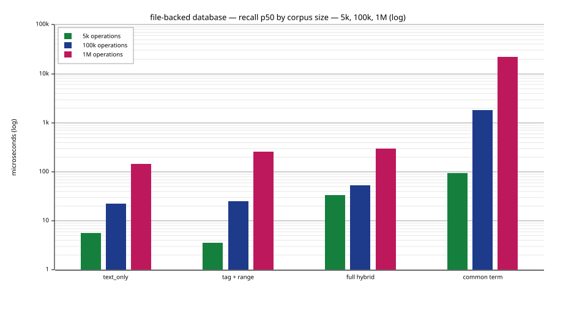
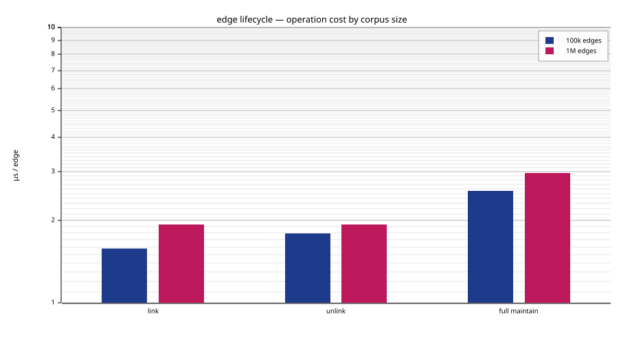
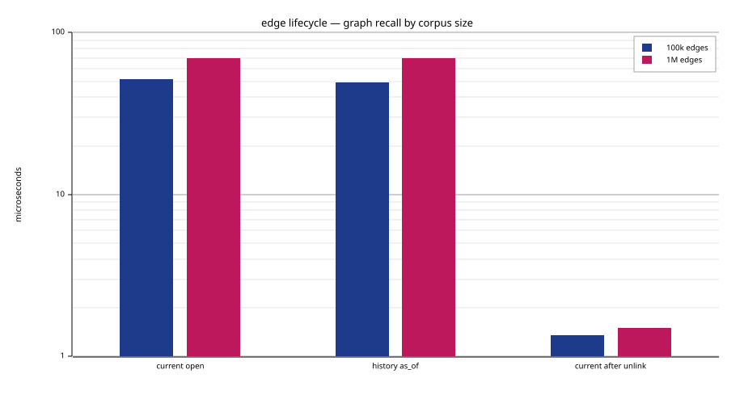

# plugmem

<p align="center">
  
</p>

<p align="center">
  <a href="https://crates.io/crates/plugmem-host"></a>
  <a href="https://docs.rs/plugmem-host"></a>
  <a href="https://www.npmjs.com/package/plugmem"></a>
  <a href="https://pypi.org/project/plugmem/"></a>
  <a href="https://github.com/m62624/plugmem/actions/workflows/ci.yml"></a>
  <a href="https://codecov.io/gh/m62624/plugmem"></a>
  <a href="#license"></a>
</p>

> ⚠️ Experimental. plugmem is mostly an AI-built experiment, written with
> the help of a small local model (Qwen3.6-35B-A3B-UD-Q4_K_XL.gguf) and various
> Claude models, in roughly equal measure. Expect non-professional design
> choices, rough edges, broken behavior, or mistakes. Use it at your own risk.

**[What it is](#what-plugmem-is) · [Which crate](#which-crate-do-i-need) ·
[How recall works](#what-recall-does) · [Measured scale](#measured-scale) ·
[Install](#install) · [License](#license)**

## What plugmem is

An embeddable **memory database for local-first applications and agents**.
It is an in-process, file-backed engine linked directly into your program.
plugmem stores short **facts** with a subject entity, tags, optional metadata,
an optional embedding and two time axes, then answers a query with a ranked,
token-budgeted result with structured facts and edges plus an optional bounded
rendered block. It runs in-process from a manifest, immutable snapshot
generations, an append-only journal and a lock — no server, no daemon, one machine.
The core is `no_std`, so the same engine runs natively and in WebAssembly.

It is meant for a local-first application or agent on your own device or inside
your own project — one process, one local database — not a multi-tenant service fielding
queries from many users.

Recall combines four sources: lexical (BM25), vector, entity graph and time.
Reciprocal-rank fusion merges their rankings, while tags act as filters. What
the engine does:

- **two clocks per fact.** `valid_from`/`valid_to` say when a statement was
  true, `recorded_at` says when the memory learned it. `revise` closes an
  interval rather than overwriting, so `as_of` answers "what did I hold then";
  `forget` is the destructive verb and `maintain` erases the bytes.
- **a typed entity graph.** Edges between entities, opened by `link` and closed
  by `unlink`, each optionally naming the fact it follows from. An `as_of`
  traversal walks the graph as it stood then, through edges since removed.
- **opaque per-fact metadata.** A key→value map — a URI to the real payload in
  another store, a mime type, an external key. Stored and returned verbatim,
  never interpreted or searched; large blobs stay outside, by reference.
- **a bounded tag catalogue.** List current tags and their fact counts in stable
  lexical pages, optionally by prefix. Removing a tag revises every affected
  current fact without deleting the facts or their historical tag state.
- **conflicts surfaced, not resolved.** `remember` stores and returns the live
  facts a new one may duplicate or contradict. `remember_guarded` runs that
  same bounded detector and stores only when it finds no candidate, without a
  race between those steps. Ordinary `remember` remains a safe complete write.
  Recall is ranked context retrieval, not a duplicate threshold. The engine
  never merges on its own; the caller revises, forgets, or keeps both.
  **The detector is scoped to the fact's entity**, so a fact written with no
  entity is compared against nothing and a guarded write stores it
  unconditionally.
- **bounded ranked context.** Recall returns structured facts and edges and can
  render text constrained by a token budget; prompt-ready rendering is one
  consumer of the result.
- **`no_std + alloc` core.** Single-threaded, zero-allocation recall after
  warm-up, one local database, no server; built and tested on `wasm32v1-none` and a real
  32-bit wasm runtime in CI.

The two clocks are what differs from other stores. `revise` closes an interval
instead of overwriting a row, so the earlier state is still answerable:

```console
$ plugmem-cli remember "lives in Moscow" --entity kim
remembered fact 0
$ plugmem-cli revise 0 "lives in Berlin" --entity kim
remembered fact 1

$ plugmem-cli recall --entity kim
- [f1] kim: lives in Berlin (2026-08; active)

$ plugmem-cli recall --entity kim --as-of <an instant between the two>
- [f0] kim: lives in Moscow (2026-08 → 2026-08; closed)
```

Tag discovery stays bounded even when a memory has thousands of tags:

```console
$ plugmem-cli tags --prefix project: --limit 64
2\tproject:plugmem
$ plugmem-cli remove-tag project:old
removed tag "project:old" from 3 current facts
```

`as_of` moves **both** clocks: a fact answers only if it was valid at that
instant *and* had already been recorded by then. That second half is the one
people trip over: `as_of` before a fact was written returns nothing, because
the memory had not recorded the fact yet. Reporting today's knowledge would be
the wrong answer to "what did I hold".

`--valid-from` is the other half: a statement that became true before you heard
of it. Recording on March 10th that someone moved on March 1st closes the old
interval at March 1st, so a query as of March 5th finds neither — the old fact
was no longer true, and the new one was not yet known. That is not a gap in the
model. It is the only answer consistent with both clocks.

**Where it fits — and where it doesn't.** plugmem is for local-first applications,
agent memory and embedded systems: one process, one local database, no service to operate. Its interactive
design center is about 100k active facts on one machine; the benchmark suite also
tracks 1M-operation profiles to show how the same file-backed engine scales
under heavier local workloads. These numbers are measured operating points, not
format limits.

plugmem is not designed for multi-million or tens-of-millions vector workloads,
cluster sharding, multi-tenant serving, or managed nearest-neighbour search. For
that, use a dedicated vector system such as [Qdrant](https://qdrant.tech),
[Milvus](https://milvus.io), [Weaviate](https://weaviate.io),
[Pinecone](https://www.pinecone.io), or
[pgvector](https://github.com/pgvector/pgvector). plugmem's recall model is
local and hybrid: keyword search, optional vectors, typed relationships, and
time.

## Which crate do I need?

**If you write Rust and just want a working memory, use
[`plugmem-host`](crates/plugmem-host) — it has everything.** The other crates
are for narrower needs.

| You want | Use | Why |
|---|---|---|
| **A memory in a Rust program** — the common case | **[`plugmem-host`](crates/plugmem-host)** (`std`) | Everything included: files, locking, read-only mmap, HTTP embedders, integrity, cross-process concurrency. One dependency — it re-exports the engine. |
| A memory in Rust with **no `std`** or **your own storage** (browser, wasm host, custom file layer) | [`plugmem-core`](crates/plugmem-core) (`no_std`) | The engine only. You bring the `Storage` trait, the clock, file I/O and embedding — so you also manage when the file opens and how memory loads. |
| Just the **flat byte-pool containers**, to build your own index/store | [`plugmem-arena`](crates/plugmem-arena) (`no_std`) | The storage substrate, engine-agnostic. |
| A memory from a **terminal or shell script** | [`plugmem-cli`](crates/plugmem-cli) (`plugmem`) | One local database, no server; `plugmem repl` keeps the engine open for host speed. |
| A memory for an **agent, local-first app, or non-Rust program** | [`plugmem-mcp`](crates/plugmem-mcp) | Long-lived stdio JSON-RPC; language-independent. **Don't** front your own Rust with it — embed `host` instead. |
| A memory in **JavaScript / TypeScript** (Node) | [`plugmem-napi`](crates/plugmem-napi) | The engine as a native Node addon (napi-rs), in-process and typed for TS. On npm as `plugmem`. |
| A memory in **Python** | [`plugmem-py`](crates/plugmem-py) | The engine as a CPython extension (PyO3), in-process and typed. Every call releases the GIL. On PyPI as `plugmem`. |

Rust programs use the library (`host`, or `core` for specialists) — embedded
directly in-process. Other languages and agents come in through
`mcp` (or `napi` for Node/TS) — not the CLI, which is the human/scripting door.

**One thing lives only in the CLI: the JSONL file format.** `export` streams
every open fact and then every open edge to stdout, one per line, each tagged
with a `kind`; `import` reads it back in batches. Both halves stream, so a
memory of any size dumps and loads in bounded RAM. The library, the MCP server
and the Node addon return exported facts as structures, but none of them reads
or writes the file format, and none has an `import` verb — a program holding the
structures already knows how to write them back.

What crosses the round trip: text, subject entity, tags, metadata,
`valid_from`, graph edges, and each edge's provenance fact (retargeted to the id
the receiving database assigns). What does not: **closed revisions and vectors**
— history does not survive, and vectors are recomputed on import when an
embedder is configured. So JSONL is a portable knowledge dump, not a backup. For
a backup, copy the database files.

| Crate | What it is |
|---|---|
| [`plugmem-arena`](crates/plugmem-arena) | flat byte-pool storage structures (`no_std`, wasm-first) |
| [`plugmem-core`](crates/plugmem-core) | the engine: data model, indexes, recall, snapshots (`no_std`) |
| [`plugmem-host`](crates/plugmem-host) | OS glue: files, locking, mmap read-only, embedder clients (`std`) |
| [`plugmem-cli`](crates/plugmem-cli) | command-line surface, one-shot + interactive `repl` |
| [`plugmem-napi`](crates/plugmem-napi) | native Node.js addon (napi-rs), on npm as `plugmem` |
| [`plugmem-py`](crates/plugmem-py) | CPython extension module (PyO3), on PyPI as `plugmem` |
| [`plugmem-mcp`](crates/plugmem-mcp) | MCP server (stdio JSON-RPC) for agents |
| `plugmem-testgen` | deterministic corpus generator for tests and benches |

## What recall does

Recall is not a vector lookup — it fuses four sources with
[reciprocal-rank fusion](https://dl.acm.org/doi/10.1145/1571941.1572114) and a
recency boost (tags filter; they are not a source):

| Source | Algorithm | What it finds | Needs an embedder |
|---|---|---|---|
| **Lexical** | [BM25](https://en.wikipedia.org/wiki/Okapi_BM25) (Robertson idf) over a Unicode ([UAX #29](https://unicode.org/reports/tr29/)) tokenizer | exact terms / keyword overlap | no |
| **Graph** | entity graph with current typed edges on the hot path; `as_of` queries use edge history | relational knowledge | no |
| **Temporal** | range scans over a `recorded_at`-ordered index; bitemporal validity | "what was true *then*", time windows | no |
| **Semantic** | int8-quantized cosine — a flat two-phase scan below a threshold, an [HNSW](https://arxiv.org/abs/1603.09320) graph above | meaning / nearest neighbours | **yes** |

**Three of the four need no model at all**, so plugmem is usable with no API
key, no network and no per-query cost. What an embedder adds is matching by
meaning: without one, recall matches on words, so a fact reading "the user
prefers tokio" answers a query for `tokio` but not one for `which runtime?` —
anchor on the entity, or add an embedder, and it does. Configure one in
`[embedder]`; delete the section and everything else keeps working.

The configured embedding `space_id` is persisted with its vectors; it defaults
to `model`, and can name an exact revision when the server-side model is an
alias. Changing it never makes routine or automatic maintenance call the new
model: run the explicit `plugmem-cli maintain --reembed` operation to recompute
every retained fact and atomically publish the new vector space. Equal
dimensions alone are not treated as compatibility.

## Many memories in one directory (optional)

**Default: one logical memory backed by a local database layout.** Point `--db` at it and nothing below applies.

When one process serves many independent memories — a memory per conversation,
per tenant — point it at a directory instead and address them by name:

```console
$ plugmem-cli --workspace ~/bot-data --db chat-42 remember "prefers tokio"
$ plugmem-mcp --workspace ~/bot-data          # every tool gains a `db` argument
```

A name (`[a-z0-9][a-z0-9_-]*`) is not a path and cannot become one, so it
resolves to exactly one named database inside the directory. A first write to an unused
name creates that memory — no registration step. Each memory can describe what
it is for, and `workspace find` searches those descriptions when the caller does
not know the name.

Two constraints matter when building on it:

- **results are never merged across memories.** Measured: asking the right
  memory answers 98–99 % of questions well, while asking all of them and fusing
  gives 92–94 % — and 62–66 % across topics. Routing beats merging, so pick a
  memory rather than searching them all.
- **who may use which memory is not this project's responsibility.** The `db`
  comes from the caller. Your harness sees the call before the server does; put
  the policy there. The simplest setup avoids the question entirely: one process
  per conversation, started with `--db <its own memory>`, where the tools have
  no `db` argument at all.

Details in [`specs/10-workspace.md`](specs/10-workspace.md); settings in
[`crates/plugmem-host/SETTINGS.md`](crates/plugmem-host/SETTINGS.md).

## Measured scale

The following is a like-for-like native, file-backed benchmark using the same
deterministic synthetic workload at both sizes (`dim=0`, so no embedding
service is involved). Recall values are p50 latencies after the database has
been checkpointed and maintained; the 1M SVGs live in
[`plugmem-host/assets`](crates/plugmem-host/assets).

Both columns of this table, and both of the edge table below, were measured in
one session on one machine, so the sizes compare to each other. They do **not**
compare to the arena charts, whose wasm rows come from a matrix run on other
hardware and cannot be reproduced piecemeal without mixing machines into one
picture — only numbers inside the same table or the same chart are
like-for-like.

The size labels refer to ingested operations, not the final number of live
facts. The 5k column is there because it is the size a personal memory
actually is — and, until the shard layout followed the data, the size that
behaved worst: it used to pay a fixed floor sized for a million facts.

| Measurement | 5k operations | 100k operations | 1M operations |
|---|---:|---:|---:|
| Active facts after `maintain` | 4,305 | 86,010 | 860,204 |
| Pool bytes after `maintain` | 3.4 MB | 44.5 MB | 413.7 MB |
| Streaming load | 0.08 s (65,876 ops/s) | 1.65 s (60,589 ops/s) | 39.6 s (25,277 ops/s) |
| Text-only recall p50 | 6 µs | 25 µs | 147 µs |
| Full hybrid recall p50 | 34 µs | 60 µs | 302 µs |
| Single frequent term recall p50 | 0.09 ms | 2.47 ms | 25.6 ms |
| Checkpoint | 4 ms | 59 ms | 514 ms |
| `maintain` | 0.01 s | 0.20 s | 1.96 s |
| Reopen (writer) | 1 ms | 15 ms | 166 ms |
| `verify` | 1 ms | 34 ms | 320 ms |



Across the two decades from 5k to 1M the pool grows 122× for 200× the facts —
the per-fact cost *falls* (800 → 481 B) because the fixed floor amortizes away
rather than dominating. Load time is 480× for 200× the operations, so the
per-operation cost grows 2.4×; text-only recall grows 25×.

The **single frequent term** row is the worst lexical input there is, and it is
charted next to the others because it is the number to budget for. A query made
of one term the corpus uses everywhere has to decode a posting list that covers
the corpus; the stop-frequency guard drops such a term only when the query
offers a rarer one to fall back on. Ordinary queries cost microseconds, that one
costs milliseconds, and no amount of index tuning changes the shape — only the
constant.

Opening is deliberately cheap and `verify` deliberately is not: an open checks
that nothing in the image can make a read unsafe, while the cross-checks that
prove the graph *consistent* are what `plugmem verify` runs on demand.

These are machine-specific trend measurements, not release guarantees.
Reproduce both columns with:

```text
cargo run --release -p plugmem-host --example bench_database -- 100000 --diagnose-recall | tee database-benchmark-100k.tsv
cargo run --release -p plugmem-host --example bench_database -- 1000000 --diagnose-recall | tee database-benchmark-1m.tsv
cat database-benchmark-100k.tsv database-benchmark-1m.tsv > database-benchmark-scale.tsv
cargo run -p plugmem-bench-charts -- database-benchmark-scale.tsv --force
```

The chart tool averages repeated rows, so feeding it several runs of the same
size gives a steadier picture than any single one.

Edge lifecycle has a focused file-backed benchmark for `link`, `unlink`,
retained history, current graph recall, historical `as_of` graph recall, and
full maintenance after many closed edges:

```text
cargo run --release -p plugmem-host --example bench_edges -- 100000 | tee edge-benchmark-100k.tsv
cargo run --release -p plugmem-host --example bench_edges -- 1000000 | tee edge-benchmark-1m.tsv
cat edge-benchmark-100k.tsv edge-benchmark-1m.tsv > edge-benchmark-scale.tsv
cargo run -p plugmem-bench-charts -- edge-benchmark-scale.tsv --force
```

The edge workload is a hub stress case: one entity links to every leaf, then all
edges are unlinked while history is retained.

| Edge lifecycle measurement | 100k edges | 1M edges |
|---|---:|---:|
| `link` latency | 1.6 µs/edge | 1.7 µs/edge |
| `unlink` latency | 1.7 µs/edge | 1.7 µs/edge |
| Current graph recall p50 while edges are open | 53 µs | 59 µs |
| Historical `as_of` graph recall p50 after unlink | 50 µs | 55 µs |
| Full `maintain` after unlink | 0.33 s | 3.24 s |
| Retained edge-history records after unlink | 100,000 | 1,000,000 |

Per-edge cost is flat across the range rather than growing with it, and graph
recall is bounded by the expansion caps rather than by the size of the hub.
Unlinking closes an edge; it does not erase it. The history row above is the
whole point — after every edge is unlinked, and again after a full `maintain`,
the version count is unchanged and `as_of` still answers.
A second benchmark covers the other axis — a few relations relinked over and
over, which is what stresses historical traversal:

```text
cargo run --release -p plugmem-host --example bench_edge_churn -- 200 1000
```

At 200k retained versions over 200 relations: current graph recall 31 µs,
`as_of` recall 32 µs, and a full `maintain` repacks the edge arenas from
31.9 MB to 23.4 MB in 59 ms without dropping a single version.




The lexical tokenizer is [ICU4X](https://github.com/unicode-org/icu4x)-backed:
it applies Unicode [NFKC](https://unicode.org/reports/tr15/) normalization,
locale-neutral lowercase mapping,
[UAX #29](https://unicode.org/reports/tr29/) word boundaries, language-aware
[segmentation](https://docs.rs/icu_segmenter/latest/icu_segmenter/) for complex
scripts, Latin
[search folding](https://www.unicode.org/reports/tr30/tr30-4.html) and CJK
[bigrams](https://en.wikipedia.org/wiki/Bigram). Its generic Unicode path
reuses scratch buffers and performs no tokenizer-internal allocations after
warm-up. ICU4X's dictionary/[LSTM](https://en.wikipedia.org/wiki/Long_short-term_memory)
path may allocate a temporary boundary cache for scripts such as Thai and Khmer
in exchange for better word segmentation. The tokenizer emits canonical lexical
terms; it does not perform
[stemming](https://en.wikipedia.org/wiki/Stemming) or
[lemmatization](https://en.wikipedia.org/wiki/Lemmatization).

## Install

Two binaries — the `plugmem-cli` CLI (crate `plugmem-cli`) and the `plugmem-mcp`
server (crate `plugmem-mcp`) — built for **Linux, Windows and macOS (x64 &
arm64)** on every tagged release.

Choose one installation method. Each installs the same binaries.

| If you… | Use |
|---|---|
| are on macOS / Linux with Homebrew | **Homebrew** |
| don't want a Rust toolchain | **installer script**, or the Windows **`.msi`** |
| want managed install/uninstall on Windows | **`.msi`** |
| have `cargo` and want a cross-platform install | **`cargo binstall`** |
| want to compile it yourself | **from source** |

### Homebrew (macOS / Linux)

From the [`m62624/homebrew-plugmem`](https://github.com/m62624/homebrew-plugmem)
tap; `brew upgrade` / `brew uninstall` then manage it like any formula:

```console
$ brew install m62624/plugmem/plugmem-cli     # the `plugmem-cli` CLI
$ brew install m62624/plugmem/plugmem-mcp     # the `plugmem-mcp` server
```

### Installer scripts (no Rust toolchain)

Each binary has its own script on the
[Releases page](https://github.com/m62624/plugmem/releases); `latest` always
points at the newest tag.

```console
# Linux / macOS  (POSIX sh)
$ curl --proto '=https' --tlsv1.2 -LsSf https://github.com/m62624/plugmem/releases/latest/download/plugmem-cli-installer.sh | sh
$ curl --proto '=https' --tlsv1.2 -LsSf https://github.com/m62624/plugmem/releases/latest/download/plugmem-mcp-installer.sh | sh
```

### Windows `.msi`

Download `plugmem-cli-*.msi` or `plugmem-mcp-*.msi` from the
[Releases page](https://github.com/m62624/plugmem/releases). Double-click to
install; it registers the app in **"Add or remove programs"**, so upgrades and
uninstalls go through the normal Windows UI.

### Windows PowerShell script (alternative to `.msi`)

If you prefer a script over a GUI installer:

```powershell
> powershell -ExecutionPolicy Bypass -c "irm https://github.com/m62624/plugmem/releases/latest/download/plugmem-cli-installer.ps1 | iex"
> powershell -ExecutionPolicy Bypass -c "irm https://github.com/m62624/plugmem/releases/latest/download/plugmem-mcp-installer.ps1 | iex"
```

### `cargo binstall`

[cargo-binstall](https://github.com/cargo-bins/cargo-binstall) downloads the
prebuilt binary instead of compiling. It reads the release's cargo-dist
manifest and supports every OS/architecture listed above without extra config:

```console
$ cargo binstall plugmem-cli     # the `plugmem-cli` binary
$ cargo binstall plugmem-mcp     # the `plugmem-mcp` binary
```

### Agent skill

The repository also ships an [Agent Skill](skills/plugmem/SKILL.md) with the
remember/recall workflow and API conventions. With GitHub CLI 2.90 or newer:

```console
$ gh skill install m62624/plugmem plugmem
```

This installs the skill instructions, not the plugmem binaries. The command is
currently in public preview; see the
[`gh skill install` manual](https://cli.github.com/manual/gh_skill_install).

### From source

Needs a Rust toolchain; compiles locally and works on any platform Rust targets.
Both crates are published to crates.io, so you can build straight from there:

```console
$ cargo install plugmem-cli     # the `plugmem-cli` binary
$ cargo install plugmem-mcp     # the `plugmem-mcp` binary
```

…or from a local checkout of this repo:

```console
$ cargo install --path crates/plugmem-cli
$ cargo install --path crates/plugmem-mcp
```

### Uninstall

**Installed with `cargo binstall` / `cargo install`** (either resolves to cargo's
own install tracking, so plain `cargo uninstall` works):

```console
$ cargo uninstall plugmem-cli      # removes the `plugmem-cli` binary
$ cargo uninstall plugmem-mcp
```

**Installed with Homebrew:** `brew uninstall plugmem-cli plugmem-mcp`.

**Installed from a Windows `.msi`:** uninstall from **"Add or remove programs"**
(or Settings → Apps), exactly like any other Windows app.

**Installed with the shell/PowerShell scripts:** cargo-dist does not ship an
uninstaller, so remove the binaries and their install receipts by hand. By default
the binaries land in `~/.cargo/bin` (note: `cargo uninstall` won't touch these —
cargo didn't track them), and a receipt is written per app.

```console
# Linux / macOS
$ rm -f  ~/.cargo/bin/plugmem-cli ~/.cargo/bin/plugmem-mcp
$ rm -rf ~/.config/plugmem-cli ~/.config/plugmem-mcp     # install receipts
```

```powershell
# Windows (PowerShell)
> Remove-Item "$env:USERPROFILE\.cargo\bin\plugmem-cli.exe","$env:USERPROFILE\.cargo\bin\plugmem-mcp.exe" -ErrorAction SilentlyContinue
> Remove-Item "$env:LOCALAPPDATA\plugmem-cli","$env:LOCALAPPDATA\plugmem-mcp" -Recurse -ErrorAction SilentlyContinue
```

If you pointed the installer somewhere else (`PLUGMEM_CLI_INSTALL_DIR` /
`PLUGMEM_MCP_INSTALL_DIR`, or `CARGO_DIST_FORCE_INSTALL_DIR`), delete from that
directory instead. The installer may also have added the bin dir to your `PATH` —
prune that line from your shell profile if nothing else uses it.

## License

MIT.
