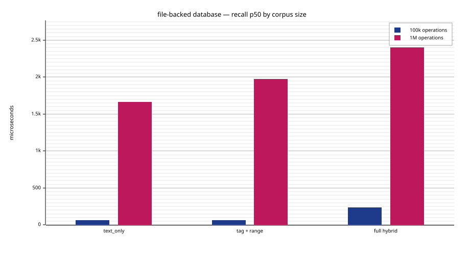

# plugmem

<p align="center">
  
</p>

<p align="center">
  <a href="https://crates.io/crates/plugmem-host"></a>
  <a href="https://docs.rs/plugmem-host"></a>
  <a href="https://www.npmjs.com/package/plugmem"></a>
  <a href="https://github.com/m62624/plugmem/actions/workflows/ci.yml"></a>
  <a href="https://codecov.io/gh/m62624/plugmem"></a>
  <a href="#license"></a>
</p>

> ⚠️ Experimental. plugmem is mostly an AI-built experiment — written with
> the help of a small local model (Qwen3.6-35B-A3B-UD-Q4_K_XL.gguf) and various
> Claude models, in roughly equal measure. Expect non-professional design
> choices, rough edges, broken behavior, or mistakes. Use it at your own risk.

An embeddable **memory database for local LLM agents** — you link it into your
program like SQLite, in-process and single-file. plugmem stores short
**facts** — with a subject entity, tags, optional metadata, an optional
embedding and two time axes — and answers a query with a ranked,
token-budgeted block ready to paste into a prompt. It runs in-process from one
snapshot file plus an append-only journal — no server, no daemon, one machine.
The core is `no_std`, so the same engine runs natively and in WebAssembly.

It is meant for a local agent on your own device or inside your own project —
one process, one file — not a multi-tenant service fielding queries from many
users.

It is **not** a vector database. A vector is one of four recall sources —
lexical (BM25), vector, entity graph and time — fused with reciprocal-rank
fusion; tags act as filters. What plugmem is actually about:

- **bitemporal facts** — `revise`/`forget`, "what was true *then*" vs now,
  revision chains kept intact, physical erasure on `maintain`;
- **an entity graph** — typed edges between entities, relational knowledge,
  not just nearest-neighbor vectors;
- **opaque per-fact metadata** — an optional key→value map (a URI to the real
  payload in another store, a mime type, an external key); the engine stores
  and returns it but never interprets it — big blobs live outside, by reference;
- **conflict surfacing on `remember`** — a new fact comes back with the
  live facts it may duplicate or contradict; the engine never merges on
  its own, the caller decides;
- **a compact rendered block** — the result is selected greedily under a
  token budget, ready for the prompt;
- **embeddable everywhere** — single-threaded `no_std + alloc` core,
  zero-allocation recall after warm-up, one file, no server; built and
  tested on `wasm32v1-none` and a real 32-bit wasm runtime in CI.

**Where it fits — and where it doesn't.** plugmem holds the memory of a local
agent or an embedded system: one process, one file, nothing to run. It targets a
single machine, with ~100k active facts as the interactive design center and
~1M facts as a tested upper-bound profile. At ~100k, the reference workload keeps
full hybrid recall sub-millisecond; at ~1M, the database remains usable but
hybrid recall and maintenance become materially slower. These are measured
operating points, not hard format limits or release guarantees. It is not a
distributed vector store. For nearest-neighbour search over tens of millions of
embeddings, sharded across a cluster or behind a managed API, use a dedicated
one ([Qdrant](https://qdrant.tech), [Milvus](https://milvus.io),
[Weaviate](https://weaviate.io), [Pinecone](https://www.pinecone.io),
[pgvector](https://github.com/pgvector/pgvector)). plugmem trades that scale for
zero infrastructure and recall that combines keyword, meaning, relationships and
time, not vectors alone.

## Which crate do I need?

**If you write Rust and just want a working memory, use
[`plugmem-host`](crates/plugmem-host) — it has everything.** The other crates
are for narrower needs.

| You want | Use | Why |
|---|---|---|
| **A memory in a Rust program** — the common case | **[`plugmem-host`](crates/plugmem-host)** (`std`) | Everything included: files, locking, read-only mmap, HTTP embedders, integrity, cross-process concurrency. One dependency — it re-exports the engine. |
| A memory in Rust with **no `std`** or **your own storage** (browser, wasm host, custom file layer) | [`plugmem-core`](crates/plugmem-core) (`no_std`) | The engine only. You bring the `Storage` trait, the clock, file I/O and embedding — so you also manage when the file opens and how memory loads. |
| Just the **flat byte-pool containers**, to build your own index/store | [`plugmem-arena`](crates/plugmem-arena) (`no_std`) | The storage substrate, engine-agnostic. |
| A memory from a **terminal or shell script** | [`plugmem-cli`](crates/plugmem-cli) (`plugmem`) | One file, no server; `plugmem repl` keeps the engine open for host speed. |
| A memory for an **LLM agent** or a **non-Rust program** | [`plugmem-mcp`](crates/plugmem-mcp) | Long-lived stdio JSON-RPC; language-independent. **Don't** front your own Rust with it — embed `host` instead. |
| A memory in **JavaScript / TypeScript** (Node) | [`plugmem-napi`](crates/plugmem-napi) | The engine as a native Node addon (napi-rs), in-process and typed for TS. On npm as `plugmem`. |

Rust programs use the library (`host`, or `core` for specialists) — embedded
in-process, like linking SQLite. Other languages and agents come in through
`mcp` (or `napi` for Node/TS) — not the CLI, which is the human/scripting door.

| Crate | What it is |
|---|---|
| [`plugmem-arena`](crates/plugmem-arena) | flat byte-pool storage structures (`no_std`, wasm-first) |
| [`plugmem-core`](crates/plugmem-core) | the engine: data model, indexes, recall, snapshots (`no_std`) |
| [`plugmem-host`](crates/plugmem-host) | OS glue: files, locking, mmap read-only, embedder clients (`std`) |
| [`plugmem-cli`](crates/plugmem-cli) | command-line surface, one-shot + interactive `repl` |
| [`plugmem-napi`](crates/plugmem-napi) | native Node.js addon (napi-rs), on npm as `plugmem` |
| [`plugmem-mcp`](crates/plugmem-mcp) | MCP server (stdio JSON-RPC) for agents |
| `plugmem-testgen` | deterministic corpus generator for tests and benches |

## What recall does

Recall is not a vector lookup — it fuses four sources with
[reciprocal-rank fusion](https://dl.acm.org/doi/10.1145/1571941.1572114) and a
recency boost (tags filter; they are not a source):

| Source | Algorithm | What it finds |
|---|---|---|
| **Lexical** | [BM25](https://en.wikipedia.org/wiki/Okapi_BM25) (Robertson idf) over a Unicode ([UAX #29](https://unicode.org/reports/tr29/)) tokenizer | exact terms / keyword overlap |
| **Semantic** | int8-quantized cosine — a flat two-phase scan below a threshold, an [HNSW](https://arxiv.org/abs/1603.09320) graph above | meaning / nearest neighbours |
| **Graph** | entity graph with typed edges, breadth-first from query anchors | relational knowledge |
| **Temporal** | range scans over a `recorded_at`-ordered index; bitemporal validity | "what was true *then*", time windows |

## Measured scale

The following is a like-for-like native, file-backed benchmark using the same
deterministic synthetic workload at both sizes (`dim=0`, so no embedding
service is involved). Recall values are p50 latencies after the database has
been checkpointed and maintained; the 1M SVGs live in
[`plugmem-host/assets`](crates/plugmem-host/assets).

The size labels refer to ingested operations, not the final number of live
facts. After maintenance, the two runs contain approximately 86k and 860k
active facts respectively.

| Measurement | 100k operations | 1M operations |
|---|---:|---:|
| Active facts after `maintain` | 86,010 | 860,204 |
| Pool bytes after `maintain` | 56.8 MB | 382.0 MB |
| Streaming load | 7.88 s (12,689 ops/s) | 148.32 s (6,742 ops/s) |
| Text-only recall p50 | 52 µs | 1.91 ms |
| Full hybrid recall p50 | 636 µs | 4.89 ms |
| Checkpoint | 69 ms | 550 ms |
| `maintain` | 0.68 s | 13.85 s |



The 1M run holds roughly 10× as many active facts while the pool is 6.7×
larger. Total load time is 18.8× higher, but the per-operation load cost grows
by 1.9×; full hybrid recall grows by 7.7×. These are machine-specific trend
measurements, not release guarantees. Reproduce both columns with:

```text
cargo run --release -p plugmem-host --example bench_database -- 100000 --diagnose-recall | tee database-benchmark-100k.tsv
cargo run --release -p plugmem-host --example bench_database -- 1000000 --diagnose-recall | tee database-benchmark-1m.tsv
cat database-benchmark-100k.tsv database-benchmark-1m.tsv > database-benchmark-scale.tsv
cargo run -p plugmem-bench-charts -- database-benchmark-scale.tsv --force
```

The lexical tokenizer is ICU4X-backed: it applies Unicode NFKC normalization,
locale-neutral lowercase mapping, UAX #29 word boundaries, language-aware
segmentation for complex scripts, Latin search folding and CJK bigrams. Its
generic Unicode path reuses scratch buffers and performs no tokenizer-internal
allocations after warm-up. ICU4X's dictionary/LSTM path may allocate a
temporary boundary cache for scripts such as Thai and Khmer in exchange for
better word segmentation. The tokenizer emits canonical lexical terms; it
does not perform stemming or lemmatization.
## Install

Two binaries — the `plugmem-cli` CLI (crate `plugmem-cli`) and the `plugmem-mcp`
server (crate `plugmem-mcp`) — built for **Linux, Windows and macOS (x64 &
arm64)** on every tagged release.

**Pick the one method that's convenient — you don't need more than one.** They all
install the *same* binaries. Quick guide:

| If you… | Use |
|---|---|
| are on macOS / Linux with Homebrew | **Homebrew** |
| don't want a Rust toolchain | **installer script**, or the Windows **`.msi`** |
| want managed install/uninstall on Windows | **`.msi`** |
| have `cargo` and want a cross-platform install | **`cargo binstall`** |
| want to compile it yourself | **from source** |

### Homebrew (macOS / Linux)

From the [`m62624/homebrew-plugmem`](https://github.com/m62624/homebrew-plugmem)
tap; `brew upgrade` / `brew uninstall` then manage it like any formula:

```console
$ brew install m62624/plugmem/plugmem-cli     # the `plugmem-cli` CLI
$ brew install m62624/plugmem/plugmem-mcp     # the `plugmem-mcp` server
```

### Installer scripts (no Rust toolchain)

Each binary has its own script on the
[Releases page](https://github.com/m62624/plugmem/releases); `latest` always
points at the newest tag.

```console
# Linux / macOS  (POSIX sh)
$ curl --proto '=https' --tlsv1.2 -LsSf https://github.com/m62624/plugmem/releases/latest/download/plugmem-cli-installer.sh | sh
$ curl --proto '=https' --tlsv1.2 -LsSf https://github.com/m62624/plugmem/releases/latest/download/plugmem-mcp-installer.sh | sh
```

### Windows `.msi`

Download `plugmem-cli-*.msi` or `plugmem-mcp-*.msi` from the
[Releases page](https://github.com/m62624/plugmem/releases). Double-click to
install; it registers the app in **"Add or remove programs"**, so upgrades and
uninstalls go through the normal Windows UI.

### Windows PowerShell script (alternative to `.msi`)

If you prefer a script over a GUI installer:

```powershell
> powershell -ExecutionPolicy Bypass -c "irm https://github.com/m62624/plugmem/releases/latest/download/plugmem-cli-installer.ps1 | iex"
> powershell -ExecutionPolicy Bypass -c "irm https://github.com/m62624/plugmem/releases/latest/download/plugmem-mcp-installer.ps1 | iex"
```

### `cargo binstall`

[cargo-binstall](https://github.com/cargo-bins/cargo-binstall) downloads the
prebuilt binary instead of compiling. It reads the release's cargo-dist
manifest, so it just works on every OS/arch above — no extra config:

```console
$ cargo binstall plugmem-cli     # the `plugmem-cli` binary
$ cargo binstall plugmem-mcp     # the `plugmem-mcp` binary
```

### From source

Needs a Rust toolchain; compiles locally and works on any platform Rust targets.
Both crates are published to crates.io, so you can build straight from there:

```console
$ cargo install plugmem-cli     # the `plugmem-cli` binary
$ cargo install plugmem-mcp     # the `plugmem-mcp` binary
```

…or from a local checkout of this repo:

```console
$ cargo install --path crates/plugmem-cli
$ cargo install --path crates/plugmem-mcp
```

### Uninstall

**Installed with `cargo binstall` / `cargo install`** (either resolves to cargo's
own install tracking, so plain `cargo uninstall` works):

```console
$ cargo uninstall plugmem-cli      # removes the `plugmem-cli` binary
$ cargo uninstall plugmem-mcp
```

**Installed with Homebrew:** `brew uninstall plugmem-cli plugmem-mcp`.

**Installed from a Windows `.msi`:** uninstall from **"Add or remove programs"**
(or Settings → Apps), exactly like any other Windows app.

**Installed with the shell/PowerShell scripts:** cargo-dist does not ship an
uninstaller, so remove the binaries and their install receipts by hand. By default
the binaries land in `~/.cargo/bin` (note: `cargo uninstall` won't touch these —
cargo didn't track them), and a receipt is written per app.

```console
# Linux / macOS
$ rm -f  ~/.cargo/bin/plugmem-cli ~/.cargo/bin/plugmem-mcp
$ rm -rf ~/.config/plugmem-cli ~/.config/plugmem-mcp     # install receipts
```

```powershell
# Windows (PowerShell)
> Remove-Item "$env:USERPROFILE\.cargo\bin\plugmem-cli.exe","$env:USERPROFILE\.cargo\bin\plugmem-mcp.exe" -ErrorAction SilentlyContinue
> Remove-Item "$env:LOCALAPPDATA\plugmem-cli","$env:LOCALAPPDATA\plugmem-mcp" -Recurse -ErrorAction SilentlyContinue
```

If you pointed the installer somewhere else (`PLUGMEM_CLI_INSTALL_DIR` /
`PLUGMEM_MCP_INSTALL_DIR`, or `CARGO_DIST_FORCE_INSTALL_DIR`), delete from that
directory instead. The installer may also have added the bin dir to your `PATH` —
prune that line from your shell profile if nothing else uses it.

## License

MIT.
