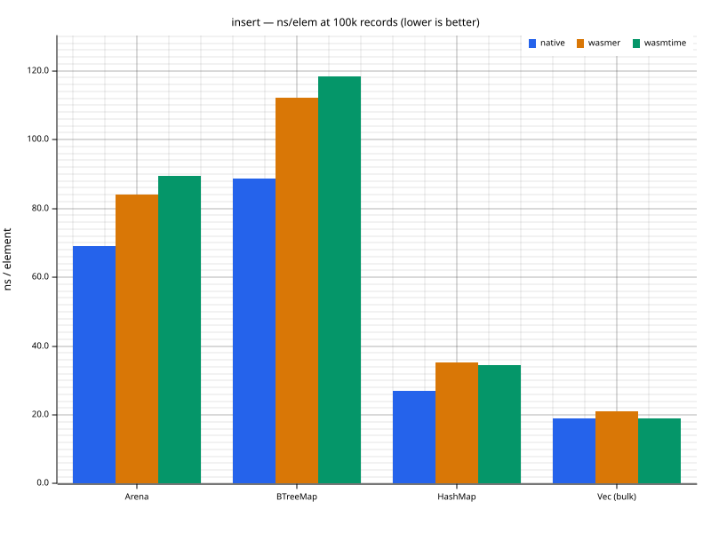
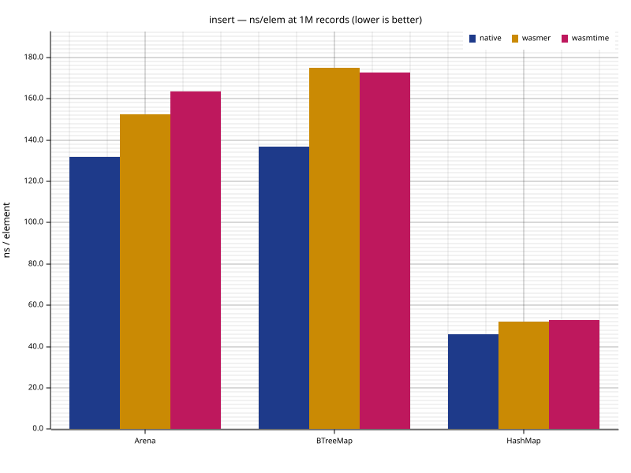
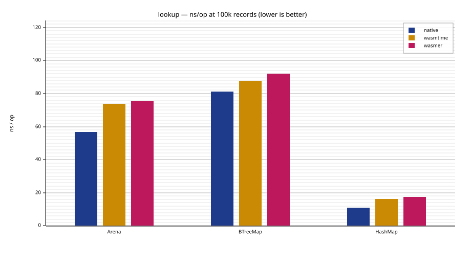
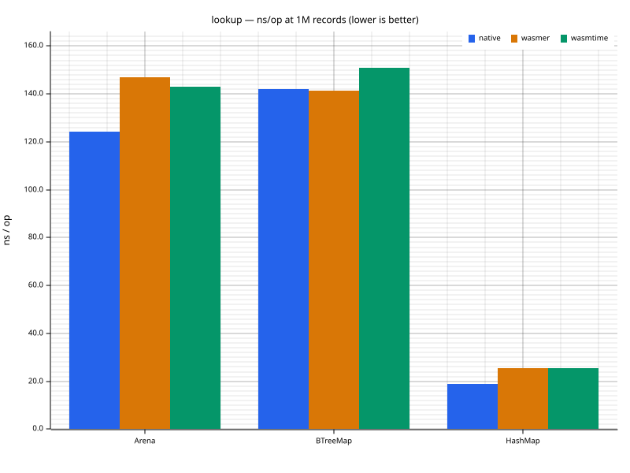
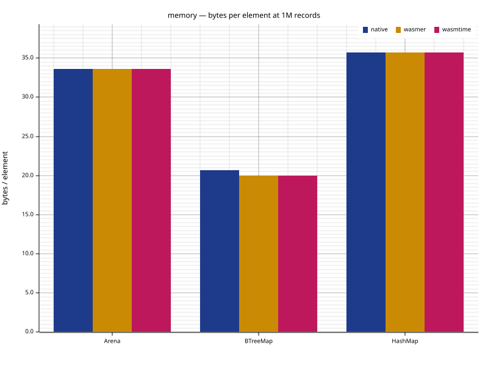
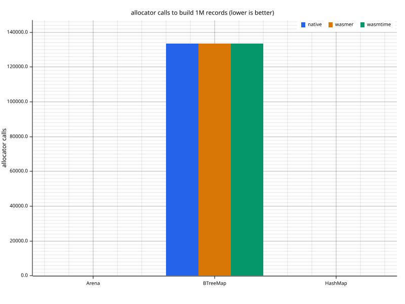
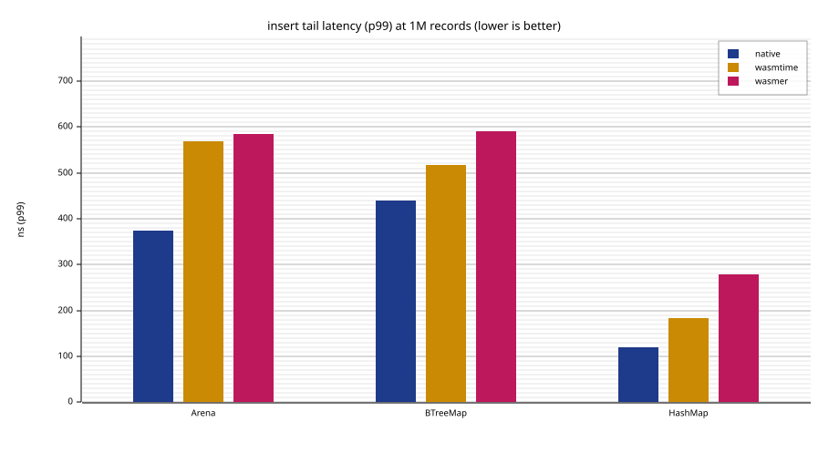
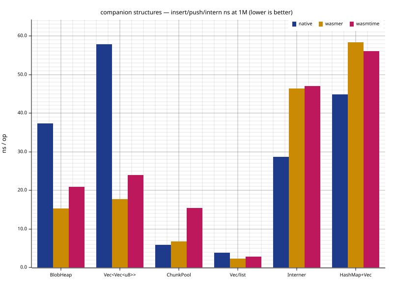
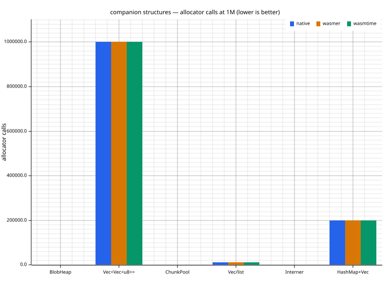

# plugmem-arena

Flat byte-pool data structures: a sharded sorted arena, an append-only
blob heap, chunked lists, and a string interner. `no_std + alloc`, no
dependencies, so it runs anywhere Rust compiles — designed for 32-bit
WebAssembly linear memory first, where allocator traffic is expensive:
each structure's whole lifetime is a near-constant number of allocator
calls (≈40 to build a million records), and its in-memory representation
*is* its serialized form, so persisting is a `memcpy` and loading is a
bounds-check plus adoption — no per-record parsing, no pointer rebuild.

Nothing here knows about the data it stores. Reach for it when you need a
compact, allocation-frugal **ordered container that is its own file
format** — an ordered index, a record store, an inverted index, a string
dictionary. One user is [`plugmem-core`](https://docs.rs/plugmem-core/latest), an agent-memory
engine built on top of these four structures, but the crate stands on its
own; lift it into any project as-is.

## Which crate do I need?

This crate is the **storage substrate** — reach for it to build your own
container. If you want the agent-memory engine, not the raw structures, you
almost certainly want one of the crates below instead.

| You want | Use | Why |
|---|---|---|
| **A memory in a Rust program** — the common case | [`plugmem-host`](https://docs.rs/plugmem-host/latest) (`std`) | The full engine plus files, locking, mmap, HTTP embedders, integrity, concurrency. |
| The memory engine with **no `std`** or **your own storage** | [`plugmem-core`](https://docs.rs/plugmem-core/latest) (`no_std`) | The engine built on these structures; you bring persistence. |
| **Flat byte-pool containers** to build your own index/store | **`plugmem-arena`** (this crate) | Engine-agnostic storage: knows nothing about the data it holds. |
| A memory from a **terminal**, an **LLM agent**, or **JavaScript / TypeScript** | `plugmem-cli` / `plugmem-mcp` / `plugmem-napi` | The command-line, agent (stdio JSON-RPC) and native Node addon surfaces. |

## Design

1. **State is flat bytes.** A container is one contiguous byte pool plus a
   few small metadata arrays (`u32` page indexes, `u16` fill counts). No
   per-element allocations, no pointer graphs. Persisting a container is a
   `memcpy` of its sections; loading is bounds-checking the metadata and
   adopting the bytes.
2. **Costs are local.** Every operation touches O(1) 4 KiB pages: a shard
   is picked in O(1) (top key bits or Fibonacci hash), a short chain walk
   peeks one first-key per page, then binary search and a bounded `memmove`
   inside one page.
3. **32-bit friendly.** Ids are `u32`; byte-pool offsets are `usize`, so a
   pool follows the target's address space — capped at 4 GiB on wasm32 linear
   memory, RAM-bound on a 64-bit host. Serialized dumps store lengths, not
   offsets, so the format is identical across pointer widths.
4. **Borrowed opens are zero-copy.** A container can open *over* a borrowed
   buffer — its dumped sections inside a longer-lived slice — without copying
   them, while later writes accumulate in a small owned tail (`load_borrowed` /
   the page-level `load_overlay`). This is a general primitive: the crate is
   storage-agnostic and names no host. It exists because the append-only
   structures never rewrite an existing record, so a blob or page is wholly in
   the borrowed base or wholly in the tail — no per-page copy-on-write. A caller
   that memory-maps a file gets an open-and-append over gigabytes that touches
   only the pages it reads; a caller that owns its bytes simply passes them and
   the tail holds everything. The arena does not know or care which.

### Memory image = file format

The property everything else here trades for, spelled out. A pointer-based
container (a `BTreeMap`'s nodes, every `String` in a `HashMap`) stores
heap addresses that are only meaningful inside the current process, so
persisting it requires walking the structure and re-encoding it, and
loading requires rebuilding it node by node — at 1M records that rebuild
is 133,419 allocations and ~126 ms of inserts before the first query.

The arena's entire state is four flat arrays with no pointers in them:

| section | type | contents |
|---|---|---|
| `pool` | `Vec<u8>` | the records themselves, in 4 KiB pages |
| `heads` | `Vec<u32>` | shard → first page of its chain |
| `next` | `Vec<u32>` | page → next page (chain or free-list) |
| `counts` | `Vec<u16>` | page → occupied slots |

Page references are indexes, not addresses — "page 7" means the same
thing in any process, on any machine, under any runtime. Keys are stored
big-endian, so the byte order of the format does not depend on the host.
Consequently:

- **Save** = write the sections to disk in sequence. No traversal, no
  per-record encoding.
- **Load** = read the file into memory, then validate *metadata only*, in
  O(pages): every page index in bounds, every count within page capacity,
  chains cycle-free (one bitmap pass). Record contents are not inspected —
  they are the owner's data. After validation the structure is live; not
  a single record was re-inserted, not a single per-element allocation
  happened.

Cold start therefore costs disk bandwidth (a 1M-record arena is ~33 MB
sequential read) plus microseconds of validation, versus a full rebuild
for pointer-based structures. `BlobHeap` (two sections), `ChunkPool`
(pool + fill counts) and `Interner` (heap + probe table, stored rather
than rebuilt) follow the same contract.

Status: the property is structural and holds today (every structure's
state is exactly these flat sections); the public `dump`/`load` API with
the validation pass and corrupt-input tests lands with the snapshot layer
(`specs/03`), which also defines how the arena's uninitialized page tails
are excluded from written output.

### Relation to a B-tree

`Arena` is the leaf level of a B+-tree without interior nodes. Where
`std::collections::BTreeMap` allocates linked nodes of up to 11 elements
and descends them by pointer (each hop is a potential cache miss and its
own heap allocation), the arena replaces the interior levels with O(1)
sharding and keeps records in 4 KiB pages inside one pool. The measured
consequences at 1M records: **40 allocator calls versus 133,419** for
`BTreeMap`, no pointer chasing on lookups, and a serialization format for
free. The price is paid in page fill (see the memory numbers) and in the
in-page `memmove` on insert.

## The four structures

| Structure | Shape | Typical use |
|---|---|---|
| `Arena<T: Slot>` | sorted fixed-size records, sharded chains of 4 KiB pages | record stores, ordered indexes |
| `BlobHeap` | append-only variable-length blobs, dense `u32` ids | texts, names, raw vectors |
| `ChunkPool` | many small growable lists over 64-byte chunks | posting lists, adjacency lists |
| `Interner` | string → dense `u32` (heap + flat hash table) | terms, tags, entity names |

Keys are **big-endian**: byte-wise comparison equals numeric comparison, so
binary search, ordered iteration and range scans run on raw bytes.

## Quick start

```rust
use plugmem_arena::{Arena, ArenaCfg, ShardMode, Slot, key};

/// A fixed-size record: 4-byte big-endian key + 1-byte payload.
struct Rec { id: u32, level: u8 }

impl Slot for Rec {
    const SIZE: usize = 5;
    const KEY_LEN: usize = 4;
    fn write(&self, out: &mut [u8]) {
        key::write_u32(out, self.id);
        out[4] = self.level;
    }
    fn read(bytes: &[u8]) -> Self {
        Rec { id: key::read_u32(bytes), level: bytes[4] }
    }
}

let mut arena = Arena::<Rec>::new(ArenaCfg::new(64, ShardMode::Ordered))?;
arena.insert(&Rec { id: 7, level: 3 })?;
arena.insert(&Rec { id: 1, level: 9 })?;

// Ordered mode: iteration and range scans in global key order.
let ids: Vec<u32> = arena.iter().map(|r| r.id).collect();
assert_eq!(ids, [1, 7]);
# Ok::<(), plugmem_arena::Error>(())
```

See `examples/basic.rs` for a walkthrough and the crate docs for page-split
mechanics, the free-list, and `range()` scans.

## Measurements

Framing: the arena's class is *ordered map over flat memory with
incremental updates* — its direct peer below is `std::BTreeMap`. `HashMap`
(no ordering, no range scans) and a bulk-built sorted `Vec` (no incremental
inserts) are included as out-of-class baselines, plus an *incrementally*
maintained sorted `Vec` to show what the flat baseline costs once inserts
are actually incremental. Workload: 16-byte records — 12-byte big-endian
composite key `[u64 | u32]` plus 4-byte payload — seeded xorshift keys,
identical streams on every runtime. One thread. The charts below are
rendered from the stand's output by
[`plugmem-bench-charts`](https://github.com/m62624/plugmem/tree/main/tools/bench-charts) (plotters — pure Rust,
no browser), averaged over several runs; regenerating them is one command
(see [Reproduction stand](#reproduction-stand)). Allocator-call charts use
a logarithmic y-axis — those values span five orders of magnitude, so a
linear axis would hide the low bars.

### Throughput — insert and lookup






Insert and lookup beat `BTreeMap` on every runtime; the gap is widest at
100k and narrows toward parity on insert at 1M (lookup stays ahead). The
wasm penalty is structural, not incidental — `BTreeMap`'s pointer descent
costs more under a runtime while the arena's flat pool keeps its shape.
`HashMap` (unordered, no range scans) and a bulk-built `Vec` (no
incremental inserts) are out-of-class baselines: reach for them when you
do not need ordering, range scans or the snapshot property.

### Memory, allocator traffic, tail latency





Memory is the arena's main cost: split pages average ~70% fill and the
pool grows by doubling, so bytes/element sit above `BTreeMap`'s (a planned
compaction rebuild recovers most of it). In return the allocator is barely
touched — a near-constant ~40 calls to build a million records, versus one
per node for `BTreeMap` — so build time carries no allocator noise and
fragmentation does not accumulate. The insert tail (p99) stays bounded: a
page split is one 4 KiB `memmove`, not a global rehash. The one visible
worst case is the rare pool-doubling realloc (~9 growths per 1M inserts;
a whole-pool copy, costly under wasm), mitigated by pre-sizing through
`ArenaCfg::max_bytes`.

### Where the arena loses

- **Ordered scans are ~2x `BTreeMap`** — the scan decodes fixed-size slots
  through the `Slot` trait where `BTreeMap` iterates dense leaf nodes. A
  flat `Vec` beats both by an order of magnitude if data never changes
  after a bulk build.
- **Pure lookup tables belong to `HashMap`.** Reach for the arena only
  when ordering, range scans or the snapshot-as-memcpy property matter.
- Single-threaded by design; no concurrent access.

### Companion structures

`BlobHeap`, `ChunkPool` and `Interner` against the std idiom of their
class — `Vec<Vec<u8>>`, one `Vec<u8>` per list, and
`HashMap<String, u32> + Vec<String>` respectively.




Same trade per class: each plugmem structure gives up a little per-op
speed (and, at some sizes, some pool-doubling slack in bytes) for
orders-of-magnitude fewer allocator calls and a flat layout that snapshots
as a `memcpy`. The one op where a structure trails its baseline is
`Interner::resolve`, which re-validates UTF-8 on every call — a deliberate
safe-code choice over `from_utf8_unchecked` (a candidate for a future
measured-unsafe commit under the crate's "functional first, unsafe only
with numbers" policy).

## Reproduction stand

Every number above is reproducible with the in-repo stand — no
dependencies, nothing downloaded, everything driven through
`std::process::Command`:

```text
rustup target add wasm32-wasip1     # once
# install the runtimes you want to compare (the stand never installs
# anything itself; missing ones are skipped with a hint):
#   wasmtime: https://wasmtime.dev
#   wasmer:   https://wasmer.io

cargo run --release -p plugmem-bench-matrix
```

The stand builds `examples/bench_repro.rs` (std-only; a counting global
allocator measures bytes and calls) for native and `wasm32-wasip1`, runs
it on every runtime found at N=100k and N=1M, and prints per-metric
markdown tables plus a machine-readable `#TSV` block. A single
structure/runtime can be run directly:

```text
cargo run --release --example bench_repro -- 1000000
wasmtime run target/wasm32-wasip1/release/examples/bench_repro.wasm 1000000
wasmer run  target/wasm32-wasip1/release/examples/bench_repro.wasm -- 1000000
```

The charts above are rendered from that TSV by
[`plugmem-bench-charts`](https://github.com/m62624/plugmem/tree/main/tools/bench-charts) (plotters — pure Rust,
no browser). Run the stand a few times,
feed the TSV in, and it re-renders only the charts whose values moved past
the noise threshold in its `config.toml` (so a jittery re-run leaves the
committed SVGs untouched):

```text
for i in 1 2 3 4; do cargo run -qr -p plugmem-bench-matrix; done \
    | grep -P '^\d+\t' > bench.tsv
cargo run -p plugmem-bench-charts -- bench.tsv
```

Statistical micro-benchmarks (criterion, native only): `cargo bench -p
plugmem-arena`.

## The one `unsafe`

Page allocation without zeroing (`Vec::reserve` + `set_len`). Kept because
it was measured, not assumed: zeroing freshly grown pages made the wasm
allocation path **12x slower** (wasmtime, 32k pages: 3889 µs zeroed vs
316 µs uninit), while on native x86-64 the difference is noise. The safety
invariant is local — bytes of a page beyond the occupied slot count are
never read — and the whole crate passes **miri**. Bounds-check elimination
(`get_unchecked`) was measured on the same harness and rejected: ≤1% on
native, slower under wasm. `Arena` deliberately implements neither `Clone`
nor `PartialEq` (a byte-wise clone or compare would read the uninitialized
page tails); `BlobHeap` and `Interner`, which hold no uninitialized bytes,
derive them.

## Related crates

Crates solving neighboring problems, and how the class differs:

- [`btree-slab`](https://crates.io/crates/btree-slab), [`scapegoat`](https://crates.io/crates/scapegoat) —
  ordered maps over slab/arena backing (the closest class). Node-linked
  internally; the backing is an allocation strategy, not a serialization
  format — no snapshot-as-memcpy.
- [`sorted-vec`](https://crates.io/crates/sorted-vec) — flat sorted
  arrays; O(n) per random insert (the stand's incremental-`Vec` baseline
  shows the cost). The arena bounds every shift to one 4 KiB page.
- [`indexmap`](https://crates.io/crates/indexmap), [`slotmap`](https://crates.io/crates/slotmap) —
  dense-storage maps, but insertion-ordered / unordered: no key-sorted
  iteration or range scans.
- [`heapless`](https://crates.io/crates/heapless) — static capacity, no
  growth; a different point on the embedded spectrum.

## Feature flags

The crate is `no_std + alloc` unconditionally — there is no `std` feature
to toggle (it builds and is gated on `wasm32v1-none` in CI).

- `counters` — deterministic work counters on every structure (key
  comparisons, bytes shifted, pages allocated, chain steps, splits,
  interner probes). Zero cost when disabled.
- `serde` — `Serialize`/`Deserialize` on the public data types (the dense
  ids `BlobId`/`TermId`, the config structs, `ShardMode`, `ListHandle`).
  Off by default; pulls in `serde` (itself `no_std`, `derive` + `alloc`) only
  when enabled, so the default build keeps its minimal dependency set.

## Testing

75 boundary tests + 6 proptest reference models (`BTreeMap`,
`Vec<Vec<u8>>`, per-list model, `HashMap` bijection), ≥90% line coverage
with hand-audited analyzer artifacts, clippy-clean with `counters` off and
on, miri on the full suite, and `wasm32v1-none` builds as a hard gate.

## License

MIT.
