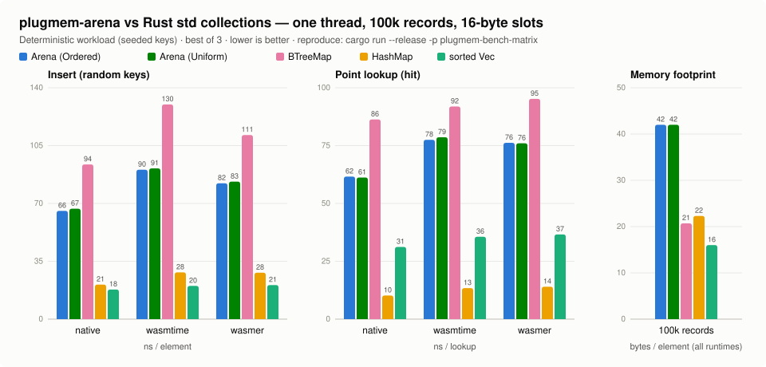
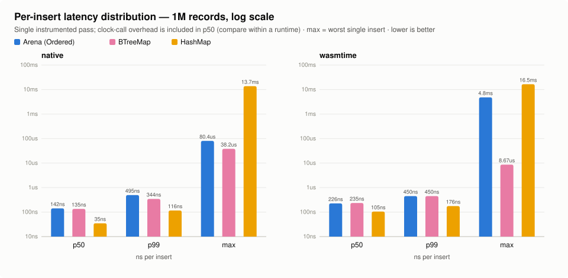
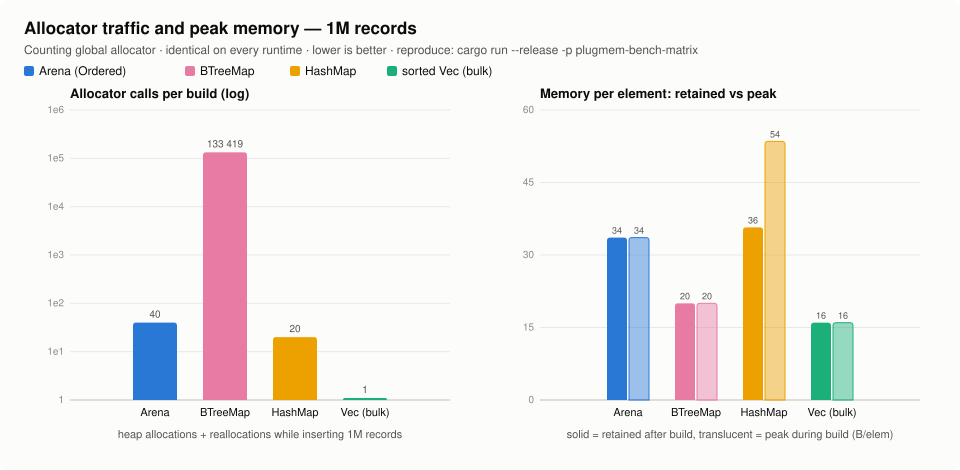

# plugmem-arena

Flat byte-pool storage structures: a sharded sorted arena, an append-only
blob heap, chunked lists, and a string interner — `no_std + alloc`,
zero-copy-persistable, designed for 32-bit WebAssembly address spaces
first and measured on native, wasmtime and wasmer.

This crate is the storage foundation of the plugmem engine, but nothing in
it knows about facts, vectors or LLMs. If you need a compact,
allocation-frugal sorted container whose in-memory representation *is* its
serialized form, you can lift it into your own project as-is.

## Design

1. **State is flat bytes.** A container is one contiguous byte pool plus a
   few small metadata arrays (`u32` page indexes, `u16` fill counts). No
   per-element allocations, no pointer graphs. Persisting a container is a
   `memcpy` of its sections; loading is bounds-checking the metadata and
   adopting the bytes.
2. **Costs are local.** Every operation touches O(1) 4 KiB pages: a shard
   is picked in O(1) (top key bits or Fibonacci hash), a short chain walk
   peeks one first-key per page, then binary search and a bounded `memmove`
   inside one page.
3. **32-bit friendly.** Ids and offsets are `u32`; pools are inherently
   capped at 4 GiB — a deliberate fit for wasm32 linear memory.

### Relation to a B-tree

`Arena` is the leaf level of a B+-tree without interior nodes. Where
`std::collections::BTreeMap` allocates linked nodes of up to 11 elements
and descends them by pointer (each hop is a potential cache miss and its
own heap allocation), the arena replaces the interior levels with O(1)
sharding and keeps records in 4 KiB pages inside one pool. The measured
consequences at 1M records: **40 allocator calls versus 133,419** for
`BTreeMap`, no pointer chasing on lookups, and a serialization format for
free. The price is paid in page fill (see the memory numbers) and in the
in-page `memmove` on insert.

## The four structures

| Structure | Shape | Typical use |
|---|---|---|
| `Arena<T: Slot>` | sorted fixed-size records, sharded chains of 4 KiB pages | record stores, ordered indexes |
| `BlobHeap` | append-only variable-length blobs, dense `u32` ids | texts, names, raw vectors |
| `ChunkPool` | many small growable lists over 64-byte chunks | posting lists, adjacency lists |
| `Interner` | string → dense `u32` (heap + flat hash table) | terms, tags, entity names |

Keys are **big-endian**: byte-wise comparison equals numeric comparison, so
binary search, ordered iteration and range scans run on raw bytes.

## Quick start

```rust
use plugmem_arena::{Arena, ArenaCfg, ShardMode, Slot, key};

/// A fixed-size record: 4-byte big-endian key + 1-byte payload.
struct Rec { id: u32, level: u8 }

impl Slot for Rec {
    const SIZE: usize = 5;
    const KEY_LEN: usize = 4;
    fn write(&self, out: &mut [u8]) {
        key::write_u32(out, self.id);
        out[4] = self.level;
    }
    fn read(bytes: &[u8]) -> Self {
        Rec { id: key::read_u32(bytes), level: bytes[4] }
    }
}

let mut arena = Arena::<Rec>::new(ArenaCfg::new(64, ShardMode::Ordered))?;
arena.insert(&Rec { id: 7, level: 3 })?;
arena.insert(&Rec { id: 1, level: 9 })?;

// Ordered mode: iteration and range scans in global key order.
let ids: Vec<u32> = arena.iter().map(|r| r.id).collect();
assert_eq!(ids, [1, 7]);
# Ok::<(), plugmem_arena::Error>(())
```

See `examples/basic.rs` for a walkthrough and the crate docs for page-split
mechanics, the free-list, and `range()` scans.

## Measurements

Framing: the arena's class is *ordered map over flat memory with
incremental updates* — its direct peer below is `std::BTreeMap`. `HashMap`
(no ordering, no range scans) and a bulk-built sorted `Vec` (no incremental
inserts) are included as out-of-class baselines, plus an *incrementally*
maintained sorted `Vec` to show what the flat baseline costs once inserts
are actually incremental. Workload: 16-byte records — 12-byte big-endian
composite key `[u64 | u32]` plus 4-byte payload — seeded xorshift keys,
identical streams on every runtime. All numbers 2026-07-18, one thread.



### 100k records (design center)

| insert ns/elem | native | wasmtime | wasmer |
|---|---|---|---|
| plugmem Arena (Ordered) | 66.5 | 93.1 | 83.3 |
| std BTreeMap | 87.4 | 110.7 | 111.8 |
| std HashMap | 21.1 | 25.7 | 25.5 |
| sorted Vec (bulk) | 18.0 | 18.2 | 18.9 |
| sorted Vec (incremental) | 6101.9 | 5974.8 | 6124.8 |

| lookup ns/op | native | wasmtime | wasmer |
|---|---|---|---|
| plugmem Arena (Uniform) | 59.3 | 77.6 | 76.7 |
| std BTreeMap | 86.0 | 84.5 | 83.5 |
| std HashMap | 10.0 | 12.5 | 11.9 |
| sorted Vec (bulk) | 30.6 | 35.3 | 35.8 |

| ordered scan ns/elem | native | wasmtime | wasmer |
|---|---|---|---|
| plugmem Arena (Ordered) | 4.5 | 6.1 | 5.6 |
| std BTreeMap | 2.9 | 2.6 | 2.6 |
| sorted Vec (bulk) | 0.4 | 0.6 | 0.8 |

### 1M records (scale ceiling for wasm32)

| insert ns/elem | native | wasmtime | wasmer |
|---|---|---|---|
| plugmem Arena (Ordered) | 123.5 | 151.6 | 150.4 |
| std BTreeMap | 125.9 | 162.4 | 163.6 |
| std HashMap | 37.6 | 40.9 | 40.9 |

| lookup ns/op | native | wasmtime | wasmer |
|---|---|---|---|
| plugmem Arena (Uniform) | 116.1 | 131.7 | 148.5 |
| std BTreeMap | 141.8 | 154.2 | 154.0 |
| std HashMap | 15.5 | 18.1 | 20.7 |

### Tail latency and allocator traffic





Per-insert latency distribution at 1M records (single instrumented pass;
clock-call overhead is included in p50, so compare within a runtime):

| ns per insert, native @1M | p50 | p99 | max |
|---|---|---|---|
| plugmem Arena (Ordered) | 142 | 495 | 80,373 |
| std BTreeMap | 135 | 344 | 38,180 |
| std HashMap | 35 | 116 | 13,742,217 |
| sorted Vec (incremental, @100k) | 4,225 | 23,250 | 32,563 |

Allocator calls per 1M-record build: Arena **40**, `HashMap` 20, bulk
`Vec` 1, `BTreeMap` **133,419** (one per node). Peak memory equals
retained for the arena and `BTreeMap`; `HashMap` peaks at 53.5 B/elem
during its final rehash (1.5x its retained 35.7).

### What these numbers say — both directions

**Where the arena wins (its class, both environments):**

- Insert and lookup are faster than `BTreeMap` on every runtime at 100k
  (insert −24% native, −16/−25% wasm; lookup −31% native). At 1M the
  insert gap narrows to parity on native and stays −7/−8% on wasm; lookup
  remains −18% native.
- The wasm gap is structural, not incidental: `BTreeMap`'s pointer descent
  costs more under a wasm runtime, while the arena's flat pool keeps its
  shape. The arena's own wasm penalty is ×1.2–1.4 over native.
- Allocator pressure is constant (~40 calls regardless of N), so build
  time contains no allocator noise and fragmentation does not accumulate.
- p99 insert latency stays under 500 ns at 1M — page splits are bounded
  (one 4 KiB `memmove` plus relinking); there is no global rehash (compare
  `HashMap`'s 13–16 ms worst insert on all runtimes) and no O(n) shift
  (compare incremental `Vec`: p50 alone is 4 µs at just 100k).
- Persistence: sections are raw slices. Nothing else in this comparison
  can serialize without walking its structure.

**Where the arena loses, and by how much:**

- **Memory: the main cost.** 42 B/elem at 100k, 33.6 at 1M, versus ~20 for
  `BTreeMap` and 16 for raw data. Split pages average ~70% fill and the
  pool grows by doubling. A compaction rebuild (planned `maintain()`)
  reaches ~16 B/elem, but the steady-state overhead is real.
- **Worst single insert is a pool realloc.** Doubling a large pool costs
  one big copy: max observed 80 µs native (the OS remaps pages), but
  **4.8 ms under wasm at 1M** — a wasm runtime must physically copy the
  16 MiB pool. Rare (9 growths per 1M inserts) but visible; pre-sizing via
  `ArenaCfg::max_bytes`-bounded reservation is the planned mitigation.
  `BTreeMap` never spikes above 38 µs — small allocations have no global
  worst case.
- **Ordered scans are ~2x slower than `BTreeMap`** (4.5 vs 2.9 ns/elem
  native): scan decodes 16-byte slots through the `Slot` trait, `BTreeMap`
  iterates dense leaf nodes. A flat `Vec` beats both by an order of
  magnitude — if data never changes after a bulk build, use a `Vec`.
- **Pure lookup tables belong to `HashMap`** (6x faster lookups). Reach
  for the arena only when ordering, range scans or the snapshot property
  are actually needed.
- Single-threaded by design; no concurrent access.

## Reproduction stand

Every number above is reproducible with the in-repo stand — no
dependencies, nothing downloaded, everything driven through
`std::process::Command`:

```text
rustup target add wasm32-wasip1     # once
# install the runtimes you want to compare (the stand never installs
# anything itself; missing ones are skipped with a hint):
#   wasmtime: https://wasmtime.dev
#   wasmer:   https://wasmer.io

cargo run --release -p plugmem-bench-matrix
```

The stand builds `examples/bench_repro.rs` (std-only; a counting global
allocator measures bytes and calls) for native and `wasm32-wasip1`, runs
it on every runtime found at N=100k and N=1M, and prints per-metric
markdown tables plus a TSV block. Historical results live in
`bench-history/`. A single structure/runtime can be run directly:

```text
cargo run --release --example bench_repro -- 1000000
wasmtime run target/wasm32-wasip1/release/examples/bench_repro.wasm 1000000
wasmer run  target/wasm32-wasip1/release/examples/bench_repro.wasm -- 1000000
```

Statistical micro-benchmarks (criterion, native only): `cargo bench -p
plugmem-arena`.

## The one `unsafe`

Page allocation without zeroing (`Vec::reserve` + `set_len`). Kept because
it was measured, not assumed: zeroing freshly grown pages made the wasm
allocation path **12x slower** (wasmtime, 32k pages: 3889 µs zeroed vs
316 µs uninit), while on native x86-64 the difference is noise. The safety
invariant is local — bytes of a page beyond the occupied slot count are
never read — and the whole crate passes **miri**. Bounds-check elimination
(`get_unchecked`) was measured on the same harness and rejected: ≤1% on
native, slower under wasm. `Arena` deliberately implements neither `Clone`
nor `PartialEq` (a byte-wise clone or compare would read the uninitialized
page tails); `BlobHeap` and `Interner`, which hold no uninitialized bytes,
derive them.

## Related crates

Crates solving neighboring problems, and how the class differs:

- [`btree-slab`](https://crates.io/crates/btree-slab), [`scapegoat`](https://crates.io/crates/scapegoat) —
  ordered maps over slab/arena backing (the closest class). Node-linked
  internally; the backing is an allocation strategy, not a serialization
  format — no snapshot-as-memcpy.
- [`sorted-vec`](https://crates.io/crates/sorted-vec) — flat sorted
  arrays; O(n) per random insert (the "incremental Vec" row above shows
  the cost). The arena bounds every shift to one 4 KiB page.
- [`indexmap`](https://crates.io/crates/indexmap), [`slotmap`](https://crates.io/crates/slotmap) —
  dense-storage maps, but insertion-ordered / unordered: no key-sorted
  iteration or range scans.
- [`heapless`](https://crates.io/crates/heapless) — static capacity, no
  growth; a different point on the embedded spectrum.

## Feature flags

- `std` *(default)* — convenience only; the crate is fully functional as
  `no_std + alloc` (built and gated on `wasm32v1-none`).
- `counters` — deterministic work counters on every structure (key
  comparisons, bytes shifted, pages allocated, chain steps, splits,
  interner probes). Zero cost when disabled.

## Testing

75 boundary tests + 6 proptest reference models (`BTreeMap`,
`Vec<Vec<u8>>`, per-list model, `HashMap` bijection), ≥90% line coverage
with hand-audited analyzer artifacts, clippy-clean in all four feature
combinations, miri on the full suite, and `wasm32v1-none` builds as a hard
gate.

## License

MIT.
