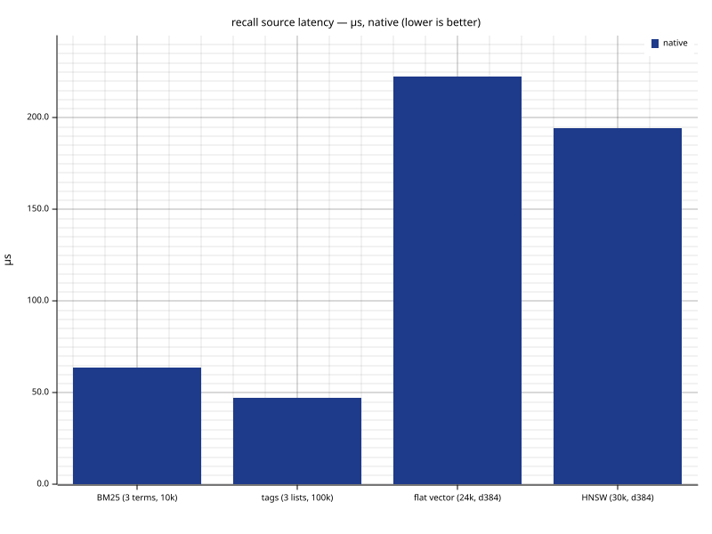

# plugmem-core

> ⚠️ Experimental. plugmem is mostly an AI-built experiment — written with
> the help of a small local model (Qwen3.6-35B-A3B-UD-Q4_K_XL.gguf) and various
> Claude models, in roughly equal measure. Expect non-professional design
> choices, rough edges, broken behavior, or mistakes. Use it at your own risk.

`plugmem-core` is an embedded **bitemporal memory and retrieval engine for
local-first applications and agents** — a library that runs inside the process.
Callers use `remember / recall / revise / forget`; recall returns ranked facts
and edges plus an optional rendered block constrained by a token budget. That
block is useful for prompts, but it is not the only consumer of the result.
It keeps a whole database image in a snapshot plus an append-only journal when
the host supplies persistence; storage is flat byte arenas, so the memory image
*is* the snapshot format (loading is a bounds-check plus adopt, replay is deterministic to
the byte, and the same file opens on native, wasm32 and wasm64 unchanged).

It is **not** a vector database. Recall fuses four sources by [reciprocal-rank
fusion](https://dl.acm.org/doi/10.1145/1571941.1572114) with a recency boost
(tags filter; they are not a source):

| Source | Algorithm | What it finds |
|---|---|---|
| **Lexical** | [BM25](https://en.wikipedia.org/wiki/Okapi_BM25) (Robertson idf) over a Unicode ([UAX #29](https://unicode.org/reports/tr29/)) tokenizer | exact terms / keyword overlap |
| **Semantic** | symmetric int8-quantized cosine — a flat two-phase scan below a threshold, an [HNSW](https://arxiv.org/abs/1603.09320) graph above | meaning / nearest neighbours |
| **Graph** | entity graph with typed edges, breadth-first from query anchors | relational knowledge |
| **Temporal** | range scans over a `recorded_at`-ordered index; bitemporal validity | "what was true *then*", time windows |

On top of that: **bitemporal
facts** (`revise`/`forget`, "what was true *then*", revision chains,
physical erasure), and **conflict surfacing** — a new `remember` returns
the live facts it may duplicate or contradict, and the engine never merges
on its own; the caller decides.

**This crate is the engine itself:** `no_std + alloc`, zero I/O, no clock,
no threads. Bytes enter and leave through a five-method `Storage` trait,
timestamps arrive as parameters, and embeddings are computed by the caller
— which is what lets the same engine run natively, in `wasm32v1-none`, or
anywhere else Rust compiles.

**No embedding model is required.** Of the four recall sources, only the vector
one needs embeddings; text, graph and time work with nothing but the engine.
This crate never calls a provider in any case — it has no I/O — so a vector is
something the caller supplies or omits, and omitting it costs the fourth source
and nothing else.

## Which crate do I need?

**Most Rust programs want [`plugmem-host`](https://docs.rs/plugmem-host/latest),
not this crate** — it wraps this engine with files, locking, mmap and embedders,
so you never manage storage yourself. Reach for `plugmem-core` directly only
when you need `no_std` or your own persistence.

| You want | Use | Why |
|---|---|---|
| **A memory in a Rust program** — the common case | [`plugmem-host`](https://docs.rs/plugmem-host/latest) (`std`) | Everything included: files, locking, read-only mmap, HTTP embedders (OpenAI/Ollama/LM Studio/vLLM/llama.cpp), integrity, concurrency. Re-exports this engine. |
| A memory in Rust with **no `std`** or **your own storage** (browser, wasm host, custom persistence) | **`plugmem-core`** (this crate) | The engine only. You bring the `Storage` trait, the clock, file I/O and embedding — so you manage when the file opens and how memory loads. |
| Just the **flat byte-pool containers** (sorted page arenas, blob heap, chunk pool, interner) | [`plugmem-arena`](https://docs.rs/plugmem-arena/latest) (`no_std`) | The storage substrate, engine-agnostic. |
| A memory from a **terminal or shell script** | [`plugmem-cli`](https://docs.rs/plugmem-cli/latest) (`plugmem`) | One local database, no server; `plugmem repl` keeps the engine open for host speed. |
| A memory for an **agent, local-first app, or non-Rust program** | [`plugmem-mcp`](https://docs.rs/plugmem-mcp/latest) | Long-lived stdio JSON-RPC; language-independent. In Rust, embed the host lib instead. |
| A memory in **JavaScript / TypeScript** (Node) | [`plugmem-napi`](https://github.com/m62624/plugmem/tree/main/crates/plugmem-napi) | The engine as a native Node addon (napi-rs), in-process; on npm as `plugmem`. |
| A memory in **Python** | [`plugmem-py`](https://github.com/m62624/plugmem/tree/main/crates/plugmem-py) | The engine as a CPython extension (PyO3), in-process; on PyPI as `plugmem`. |

## Who this is for

Agents and applications that need a **personal memory**: tens of
thousands to a hundred thousand facts about a user, a project, a codebase — with
temporal reasoning ("what was true then"), revision history, a
relationship graph, and hybrid retrieval, all inside the process with
file-backed persistence. It is not a horizontally scalable search cluster
and does not try to be one; the capacity passport is deliberately sized
to the 32-bit wasm address space (≤ 2 GiB, design center 100k facts,
ceiling 1M). On 64-bit hosts — native or WebAssembly 3.0
[memory64](https://github.com/WebAssembly/memory64) — the same code and
the same file format carry larger limits; see
[Targets and WebAssembly](#features-and-targets).

## Quick start

```rust
use plugmem_core::{Config, MemStorage, Memory, RecallQuery, RememberInput};

let mut store = MemStorage::new(); // file-backed storage lives in plugmem-host
let mut mem = Memory::new(Config::default()).unwrap();

let out = mem.remember(&mut store, RememberInput {
    entity: Some("user"),
    tags: &["pref"],
    ..RememberInput::text(1_784_000_000_000, "prefers tokio with pinned versions")
}).unwrap();
// out.similar lists live facts this one may duplicate or contradict —
// the engine never merges on its own; the caller decides.

let res = mem.recall(RecallQuery::text(1_784_000_100_000, "which runtime?")).unwrap();
println!("{}", res.rendered); // a compact, ranked block for the prompt

mem.snapshot(&mut store, 1_784_000_200_000).unwrap(); // full image + journal reset
```

## Usage — the four verbs, time travel, filters

Everything runs against a `Storage`; `MemStorage` is the in-memory one
(the file-backed storage with locking and durability lives in
[`plugmem-host`](https://docs.rs/plugmem-host/latest)). Timestamps are unix-millis you pass in
— the engine keeps no clock.

**Revise, then ask "what was true then" (bitemporal).** `revise` closes
the old fact's validity interval and records the successor; the old
version stays answerable through an `as_of` query.

```rust
use plugmem_core::{Config, MemStorage, Memory, RecallQuery, RememberInput};

let mut store = MemStorage::new();
let mut mem = Memory::new(Config::default()).unwrap();

let first = mem.remember(&mut store, RememberInput {
    entity: Some("user"),
    ..RememberInput::text(1_000, "lives in Moscow")
}).unwrap();
mem.revise(&mut store, first.id, RememberInput {
    entity: Some("user"),
    ..RememberInput::text(2_000, "lives in Berlin")
}).unwrap();

// As of time 1_500 the earlier fact was still valid; now, Berlin wins.
// (The entity anchor pulls the user's facts; there is no stemming, so a
// bare text query would need a word the fact actually contains.)
let then = mem.recall(RecallQuery {
    entities: &["user"],
    as_of: Some(1_500),
    ..RecallQuery::text(3_000, "where does the user live")
}).unwrap();
assert!(then.rendered.contains("Moscow"));

let now = mem.recall(RecallQuery {
    entities: &["user"],
    ..RecallQuery::text(3_000, "where does the user live")
}).unwrap();
assert!(now.rendered.contains("Berlin"));
```

**Forget, then reclaim the space.** `forget` tombstones a fact
immediately; `maintain` physically purges the tombstones and compacts the
structures. The id stays burned — never reissued.

```rust
use plugmem_core::{Config, MemStorage, Memory, RememberInput};

let mut store = MemStorage::new();
let mut mem = Memory::new(Config::default()).unwrap();

let f = mem.remember(&mut store, RememberInput::text(1_000, "temporary note")).unwrap();
mem.forget(&mut store, 2_000, f.id).unwrap();
assert!(mem.get(f.id).is_none()); // gone from every query at once

let report = mem.maintain(&mut store, 3_000).unwrap();
assert_eq!(report.purged, 1); // the bytes are reclaimed
```

**Conflict surfacing on remember.** A new `remember` returns the live
facts it may duplicate or contradict; the engine never merges on its own.

```rust
use plugmem_core::{Config, MemStorage, Memory, RememberInput};

let mut store = MemStorage::new();
let mut mem = Memory::new(Config::default()).unwrap();

mem.remember(&mut store, RememberInput {
    entity: Some("user"),
    ..RememberInput::text(1_000, "prefers tokio")
}).unwrap();

let out = mem.remember(&mut store, RememberInput {
    entity: Some("user"),
    ..RememberInput::text(2_000, "prefers the tokio runtime")
}).unwrap();
for hit in &out.similar {
    // decide yourself: revise the old one, drop this one, or keep both
    println!("possible conflict with fact {:?}", hit.id);
}
```

**Filtered recall — tags, entity, time range.** Sources compose: text
ranking, a tag filter, an entity anchor and a `recorded_at` window in one
query.

```rust
use plugmem_core::{Config, MemStorage, Memory, RecallQuery, RememberInput};

let mut store = MemStorage::new();
let mut mem = Memory::new(Config::default()).unwrap();
mem.remember(&mut store, RememberInput {
    entity: Some("plugmem"),
    tags: &["pref"],
    ..RememberInput::text(1_000, "uses tokio")
}).unwrap();

let res = mem.recall(RecallQuery {
    tags: &["pref"],
    entities: &["plugmem"],
    range: Some((0, 10_000)),
    k: 5,
    ..RecallQuery::text(2_000, "runtime")
}).unwrap();
println!("{}", res.rendered);
```

To add vector recall, set `Config { dim: N, .. }` and pass
`RememberInput { vector: Some(&embedding), .. }` (and a query `vector`);
the engine quantizes to int8 and, past a threshold, builds the HNSW graph
in `maintain`. Computing the embedding is the caller's job — which is what
[`plugmem-host`](https://docs.rs/plugmem-host/latest) automates over an HTTP embedding server.

## Data model

A **fact** is one short statement with an optional subject **entity**,
tags, an optional embedding, and two time axes (a simplified bitemporal
model):

- `recorded_at` — when the memory learned it (immutable);
- `valid_from / valid_to` — when it was/is true.

`revise` closes the old fact's validity interval and records the
successor; the old version is kept — "lived in Moscow (2023 → 2025)"
stays answerable through `as_of` queries. `forget` tombstones a fact
immediately; the next `maintain` removes it physically, and its id is
burned, never reissued. Entities form a graph through typed **edges**
(`works_at`, `depends_on`, …) with a provenance link back to the fact
that justified them. `link` opens or replaces the current edge; `unlink`
closes the current edge without deleting its history. Normal graph recall
walks the compact current-edge indexes; `as_of` graph recall walks the
historical edge indexes.

| Verb | Effect |
|---|---|
| `remember` | new fact + indexes + similar-fact hints (Jaccard term overlap, vector cosine) |
| `recall` | hybrid ranked retrieval, zero allocations after warm-up |
| `revise` | close the predecessor, record the successor, keep the chain |
| `forget` | immediate tombstone; physical purge at `maintain` |
| `link` | upsert a typed edge between entities |
| `unlink` | close the current typed edge while preserving `as_of` history |
| `maintain` | policy-driven maintenance: no-op, compaction, text reindex, vector optimization or full rebuild |
| `snapshot` | full image + journal reset |

## Retrieval

Four sources feed one ranked result:

- **Lexical** — BM25 with the Robertson idf over delta-encoded
  ([LEB128](https://en.wikipedia.org/wiki/LEB128)) posting lists; the
  tokenizer does NFKC normalization,
  [UAX #29](https://unicode.org/reports/tr29/) word segmentation, Latin
  diacritic folding and CJK bigrams. A stop-frequency guard drops query
  terms whose posting lists would dominate the cost.

### Tokenizer and allocations

`Tokenizer` owns reusable normalization and folding buffers, so callers
should reuse one tokenizer instance when processing a stream of text. After
warm-up, the generic Unicode path (including ordinary Latin, Cyrillic,
Arabic, Indic and similar text) performs no tokenizer-internal heap
allocations. The guarantee applies to the tokenizer itself; a callback that
stores emitted `&str` values may of course allocate its own output.

For complex scripts without reliable whitespace boundaries, ICU4X uses its
language-aware dictionary/LSTM segmentation path. That path may allocate a
temporary internal boundary cache, in exchange for better word segmentation
for languages such as Thai and Khmer and for relevant Japanese text. This is
intentional: the tokenizer provides broad Unicode coverage and
language-aware segmentation, but it is not a universal zero-allocation
component. It emits the same canonical tokens on native and WebAssembly
targets.

- **Vector** — embeddings are stored as symmetric int8 quantizations of
  the L2-normalized vector (f32 is never persisted). Below a configured
  threshold, search is a two-phase flat scan: a Hamming prefilter over
  1-bit sign signatures, then an exact quantized-cosine rescore of the
  best candidates. Above the threshold, maintenance builds or advances an
  [HNSW](https://arxiv.org/abs/1603.09320) graph (Malkov & Yashunin)
  with the neighbor-selection heuristic and early-stopped beam search;
  vectors added since the last build sit in a flat tail that is scanned
  exactly and merged.
- **Graph** — bounded breadth-first expansion from entity anchors over
  the edge arenas, with hard budgets on entities, edges, candidates and
  examined posting entries (a hub entity cannot blow the query up).
- **Temporal** — range scans over a `recorded_at`-ordered index.

Sources are fused with [reciprocal rank
fusion](https://dl.acm.org/doi/10.1145/1571941.1572114) (Cormack, Clarke
& Buettcher) — rank-based, so the sources need no score calibration —
plus an exponential recency boost. Selection is greedy under `k` and a
token budget, and the result includes both structured facts and a
bounded rendered block for prompts and other context-limited consumers.

## Algorithms and optimizations

One place to see every technique in the engine and *why* it is there —
each is a deliberate trade-off, not a default. Details are in the sections
around this one; this is the map.

**Memory (keep RAM ∝ number of facts, not size of content):**

- **Flat byte arenas** — all state is `Vec<u8>`/`Vec<u32>`, no `Box`/`HashMap`
  in the persistent data. Why: no pointer chasing, no per-node allocation, and
  the in-RAM image *is* the on-disk format, so load is adopt-not-parse. Cost:
  compaction is an explicit `maintain` pass, not free deletion.
- **int8 vector quantization** — embeddings stored as symmetric int8 of the
  L2-normalized vector; f32 is never persisted. Why: ~4× smaller than f32 and
  the dominant RAM consumer at scale. Cost: rescore is int8-exact, not f32-exact
  (measured harmless — see `bench-history/`).
- **Overlay open (mmap + owned tail)** — a database opens zero-copy over an
  mmap; later appends land in a small owned tail, the borrowed base is never
  cloned. Why: opening a multi-GiB file touches only the pages actually read,
  and the OS can evict them. Cost: the borrow ties the handle to the mapping's
  lifetime.
- **Disk-first maintain/recover** — the two large pools (vectors, text) stream
  through a host `Scratch` file instead of being rebuilt in RAM. Why: rebuild
  RAM becomes ∝ record count + graph, not content size, so a database larger
  than RAM can still be compacted. Cost: needs host temp-file I/O (unavailable
  on bare no_std, which falls back to the in-RAM path).
- **Streaming snapshot writer** — the image is written section-by-section, never
  materialized as one buffer. Why: a checkpoint of a huge database does not spike
  memory to the full image size.

**Speed:**

- **Two-phase vector search** — a 1-bit sign-signature Hamming prefilter
  (popcount, SIMD-friendly) narrows to `max(4k, 64)` candidates, then an exact
  int8-cosine rescore ranks them. Why: the cheap prefilter skips the expensive
  rescore for almost everything. Cost: a coarse signature can drop a true
  neighbour before rescore (widen the query `k` to recover it — nearly free).
- **HNSW graph** above a size threshold (Malkov & Yashunin) — sub-linear
  approximate search with the neighbor-selection heuristic and early-stopped
  beam. Why: linear scan stops paying off past ~tens of thousands of vectors.
  Cost: graph construction is maintenance work (~ms/vector when rebuilt) and
  approximate recall.
- **Delta + LEB128 posting lists** with a stop-frequency guard. Why: compact
  lists decode fast and a hub term cannot dominate query cost.
- **Posting-based BM25 compaction** — ordinary compaction filters existing
  posting lists instead of re-tokenizing every live document. Why: deleting
  tombstones should not make Unicode tokenization the dominant maintenance
  cost. Cost: tokenizer semantic changes require explicit text reindex.
- **Bounded everything in fusion** — per-source candidate cap (`SOURCE_CAP`),
  graph expansion budgets, greedy top-k. Why: one hub entity or one common term
  can never blow a query up; cost is a fixed ceiling regardless of data shape.
- **Zero allocations after warm-up** — `recall`/`get` reuse scratch buffers,
  enforced by a counting-allocator test. Why: predictable latency, no GC-like
  pauses.

**Quality:**

- **Reciprocal rank fusion** — merges sources by rank, not score, so no
  per-source calibration is needed. **Recency boost** and **graph decay^depth**
  tilt results toward fresh and closely-linked facts.

The two committed benchmarks that back these — `benches/engine.rs` (Criterion
speed) and `examples/recall_quality.rs` (recall vs an exact-cosine oracle) —
plus their recorded baselines in `bench-history/`, are what turn "should be
faster/accurate" into a number you can regress against.

## Storage and durability

All state lives in flat byte structures (sorted page arenas, blob heaps,
chunked lists, an interner) from `plugmem-arena`. The consequence: **the
memory image is the file format**. A snapshot is the concatenation of
each structure's sections, 64-byte aligned, with
[xxh3](https://github.com/Cyan4973/xxHash) checksums per section and
over the whole file; loading is bounds-checking the metadata and
adopting the bytes — no per-record parsing.

Between snapshots, every mutation appends one framed record to a
journal. Replay is deterministic to the byte: quantization is a pure
function, HNSW levels are a pure function of the fact id, and `maintain`
re-executes identically — so `snapshot → crash → replay` and the
uninterrupted engine produce the same file. A torn journal tail (crash
mid-append) is detected and dropped; any other inconsistency is a typed
error. Snapshots are canonical: save → load → save is byte-identical.

The loader treats every input as untrusted: arbitrary bytes can produce
any `Error` but never a panic or undefined behavior, and after a
successful load every stored id is range-checked, every chunk chain
walked, every invariant the hot path relies on re-established.

### Integrity and recovery

Loading is **trust/sparse by default** (the SQLite model): it validates the
metadata but does **not** read the container checksums or scan the two large
byte pools, so a big database opens without faulting them in. The accessors
tolerate bad bytes on their own — invalid text hides a fact, a bad vector slot
is skipped — so a corrupt image never panics. Integrity is then on demand, in
layers:

- `Memory::verify()` — content consistency: every stored text is valid UTF-8
  and the fact↔vector-slot bijection holds (the equivalent of SQLite's
  `integrity_check`).
- a resumable byte-level **container scrub** (per-section and whole-file xxh3),
  exposed by the host as `ReadOnlyDatabase::scrub()` — the bitrot detector.
- `Memory::faulty_facts()` — the per-fact salvage predicate the host's
  `recover()` uses to drop the corrupt records and write a clean copy.

Both the streaming snapshot writer (`write_snapshot_to`) and the disk-first
rebuild (`snapshot_disk_first`, over a host-provided `Scratch`) let the host
maintain and recover a database larger than RAM without ever materializing the
whole image — the engine provides the algorithm, the host the files (see
[`plugmem-host`](https://docs.rs/plugmem-host/latest) and `specs/16 §9`).

Each database carries a `db_uuid` (minted by the host at creation) so
external holders of fact ids can tell "same database" from "a different
one".

## Performance

Deterministic work counters (`cmp_ops`, `postings_decoded`,
`dist_evals`, allocation counts — behind the `counters` feature) act as
CI gates: a complexity regression fails the same way on any machine.
`recall` and `get` perform **zero allocator calls** after warm-up,
enforced by a counting-allocator test.

Per-source recall latency (single thread, native). The chart is rendered
by [`plugmem-bench-charts`](https://github.com/m62624/plugmem/tree/main/tools/bench-charts) from the
`bench_ops` example's output — the same plotters pipeline as the arena
charts:



The composite recall paths and the write side, which the chart does not
break out:

| Operation (single thread, native) | Latency |
|---|---|
| tags + time-range recall @ 100k | ~17 µs |
| hybrid recall (text + hub entity anchor) @ 100k | ~70 µs |
| `remember` (tokenize, index, quantize d384, similar-detect, journal) | ~29 µs mean |
| full HNSW rebuild during explicit maintenance | ~1.6 ms/vector |

These moved by roughly an order of magnitude against earlier releases, and the
chart above moved with them for the lexical bar. Do not read the other bars as
regressions against previously published figures: this run is on different
hardware, and only bars **within** one chart are comparable. The vector and
graph code is unchanged.

Reproduce: `cargo bench -p plugmem-core` (Criterion; a separate target,
never run under `cargo test`) for the full statistical suite, or
`cargo run --release -p plugmem-core --example bench_ops` for the chart's
`#TSV` rows. Corpora come from `plugmem-testgen` — seeded, so every run
measures the same workload.

## Capacity — what weighs what

How much is **resident** depends on the open. Through an owned `Storage`
(the in-RAM `MemStorage`, or a wasm host that owns the bytes) the whole
database is held resident. Through the native host's memory-mapped overlay
it is **not**: the mapped pages are reclaimable, and even a rebuild
(`maintain`/`recover`) streams the two big pools through scratch, so peak
RAM tracks the record count, not the image size (see
[`plugmem-host`](https://docs.rs/plugmem-host/latest) and `specs/16 §9`).
The sizes below are the **owned-resident** case — the worst case; an overlay
open residents far less.

Either way, each structure tops out at the width of its own internal index.
Every byte cost here is fixed by the `Slot` definitions in `model.rs` and the
pool strides — not estimates:

| Structure | Holds | Per unit | Indexed by | Ceiling |
|---|---|---|---|---|
| `facts` + `fact_aux` | one fact's record | 48 + 20 = **68 B** | u32 page × 4 KiB | 4.29 B facts (`u32` id) |
| `temporal` | `recorded_at` index entry | **12 B** / fact | u32 page × 4 KiB | 16 TiB pool |
| `entities` + `by_name` | one entity | 24 + 8 = **32 B** | u32 page × 4 KiB | 4.29 B entities |
| `edges_out` + `edges_in` | one current typed edge (both directions) | 28 + 28 = **56 B** | u32 page × 4 KiB | 16 TiB pool |
| `edges_hist_out` + `edges_hist_in` | one historical edge version (both directions) | 48 + 48 = **96 B** | u32 page × 4 KiB | 16 TiB pool |
| `doc_len` (BM25) | one document's length + term-set summary | **16 B** / fact | u32 page × 4 KiB | 16 TiB pool |
| `texts` (blob heap) | **all** fact texts + entity names, concatenated | its text length | **usize byte offset** | **4 GiB on 32-bit; RAM-bound on 64-bit** |
| `terms` (interner) | vocabulary: unique tokens, tags, relation names | deduped term length | **usize byte offset** | **4 GiB on 32-bit; RAM-bound on 64-bit** |
| `tag_lists` + postings | tag/term/entity → fact lists | ~varint / entry | u32 chunk × 64 B | 256 GiB each |
| `vecs` (vector pool) | one int8-quantized embedding | `8 + 8·⌈dim/64⌉ + dim` B | u32 slot | 4.29 B vectors |
| HNSW graph | neighbor blocks | ≈ `m0 × 4 B` / vector | u32 node id | 4.29 B nodes |

Two derived structures are resident on **every** open, mapped or not, because
they are rebuilt at load rather than read from the image: each arena's page
directory (20 B per 4 KiB page, ≈0.5% of its pool) and the flat document-length
index (4 B per fact id, capped to a dense id space). They buy the lookup costs
in `04-recall.md`; they are never written to the file.

Per-vector stride, concretely: **d384 → 440 B**, **d768 → 872 B**,
**d1536 → 1736 B** (f32 is never stored — only the int8 components, a
1-bit sign signature and a scale).

**The binding limit is rarely the id space.** Ids are `u32` (4.29
billion), but two softer walls arrive first:

- **`texts` 4 GiB on 32-bit** — the sum of every fact's text plus entity
  names. At ~200 B/fact that is **~21 M facts** of text; at ~120 B, ~36 M.
  The first hard wall for a text-heavy memory *on wasm32*; on a 64-bit host
  the pool offset is a `usize`, so this pool is RAM-bound, not wall-capped.
- **RAM** on the owned-resident path — and with vectors this binds first:
  d768 embeddings are 872 B each, so 10 M vectors alone are **~8.7 GiB**.
  A native overlay open sidesteps this (mmap pages are reclaimable); it is
  the ceiling for the owned/wasm path.

Worked sizes (native / wasm64; no vectors unless noted):

| Memory | Rough resident size | Fits |
|---|---|---|
| 100 k facts, ~120 B text (design center) | ~40 MB | anywhere, incl. wasm32 |
| 1 M facts + d384 vectors (wasm32 ceiling) | ~0.9 GB — arenas ~90 MB, text ~120 MB, vecs ~440 MB, index | wasm32 ≤ 2 GiB budget |
| 10 M facts + d768 vectors | ~13 GB — vecs ~8.7 GB dominate; text ~1.2 GB (< 4 GiB) | 64-bit host, comfortably |

So on 64-bit, **vectors and text dominate RAM**: you run out of memory far
sooner than the 4.29 B id space (the text pool is no longer a 4 GiB wall
there — it is `usize`-bound).

### Address-space classes

| Target | `usize` | Total resident image |
|---|---|---|
| **wasm32** (Wasm 2.0; `wasm32v1-none`, `-wasip1`) | 32-bit | **≤ 4 GiB total** — every pool + code + stack share one linear memory. Realistic DB ~1–2 GiB; design center 100 k facts, ceiling 1 M. |
| **wasm64** (Wasm 3.0 [memory64](https://github.com/WebAssembly/memory64)) | 64-bit | RAM-bound; the byte-pool offset is a 64-bit `usize`, so text/vocabulary pools lift past 4 GiB |
| **native 64-bit** | 64-bit | RAM-bound; `max_bytes` raisable past 4 GiB (text/vocabulary pools too) |
| **native 32-bit** | 32-bit | like wasm32; a > 4 GiB-class DB is refused with `ConfigMismatch` (a typed error, not corruption) |

The per-pool byte-offset ceiling is the **target's `usize`**, not a fixed
4 GiB: on a 32-bit target (wasm32) that is 4 GiB — a natural fit for linear
memory; on a 64-bit host a single text or vocabulary pool is RAM-/`max_bytes`-
bound like every other pool. The **snapshot format is identical** across
pointer widths — dumps store per-blob lengths, not offsets, so a file written
anywhere reloads anywhere it fits (a > 4 GiB-pool file simply cannot be
addressed on a 32-bit host, and is refused with `ConfigMismatch` rather than
truncated). See [WebAssembly 2.0 and 3.0](#webassembly-20-and-30).

## Limits, stated plainly

- Single-threaded, single-writer. Concurrency belongs to the embedding
  process (the [`plugmem-host`](https://docs.rs/plugmem-host/latest) crate
  serializes access to a file).
- Sizing and per-structure ceilings are laid out in
  [Capacity — what weighs what](#capacity--what-weighs-what): ≤ 2 GiB of
  state by default (the 32-bit wasm budget), `u32` ids, texts ≤ 4 KiB,
  dimensions ≤ 4096. On 64-bit builds `max_bytes` may be raised past
  4 GiB — such a database then opens only on 64-bit hosts.
- Vector search is quantized (int8) — exact f32 scores are never
  computed — and approximate above the HNSW threshold (recall@10 ≥ 0.9
  against brute force is a test gate, not a proof).
- The tokenizer does no stemming or lemmatization.
- `maintain` defaults to `Auto`: it returns a cheap no-op when no work is
  pending, compacts tombstones when present, reindexes text only when tokenizer
  semantics require it, and advances HNSW with a bounded insertion budget.
  `MaintenanceMode::Full` remains the explicit offline rebuild path.
- The snapshot format is not yet frozen (pre-1.0): a new version may
  require re-importing, not migrating.

## Features and targets

The crate is `no_std + alloc` unconditionally — there is no `std` feature
(it builds and is gated on `wasm32v1-none` in CI).

- `counters` — the deterministic work counters; zero cost when off.
- `serde` — `Serialize`/`Deserialize` on the public **data** types (ids,
  `Config`, the model records, `RememberOutcome`, `Stats`, `RecallResult`,
  `MaintainReport`, …). Owned types round-trip; borrowed inputs
  (`RememberInput`, `RecallQuery`, …) and `Error` are Serialize-only (they hold
  `&str`/`&'static str`). Off by default; forwards to `plugmem-arena/serde` so
  the re-exported ids serialize too. Behavioral types (`Memory`, `Tokenizer`,
  the index structures) are not serializable by design.

### WebAssembly 2.0 and 3.0

One source, one file format, two address-space classes:

- **wasm32** (WebAssembly 2.0 class; `wasm32v1-none`,
  `wasm32-unknown-unknown`) — the default and the portability baseline:
  runs in every engine and browser. The full contract test suite runs on
  a real 32-bit target:
  `cargo test -p plugmem-core --target wasm32-wasip1` under wasmtime.
- **wasm64** (WebAssembly 3.0
  [memory64](https://github.com/WebAssembly/memory64)) — lifts the 4 GiB
  linear-memory ceiling. The crate builds for `wasm64-unknown-unknown`
  unchanged (nightly `-Zbuild-std=core,alloc`; the target is tier 3).
  Engine support today: wasmtime and 3.0-era browsers run it; wasmer
  does not yet.

Snapshots are pointer-width independent by construction — every codec
writes fixed-width little-endian fields — and this is verified, not
assumed: the same scenario produces **byte-identical snapshots** on
native x86-64, wasm32 and wasm64 (and with `+simd128` enabled). A
database is portable across all of them as long as its configured
limits fit the host's address space; "migrating" from a 32-bit to a
64-bit deployment is opening the same file. Determinism is preserved on
purpose: the engine stays inside the Wasm 3.0 *deterministic profile*
(integer distances, total-order float comparisons, no relaxed SIMD in
any state-affecting path).

Crates are published to crates.io under these names once the format
freezes; until then, use the git repository.

## License

MIT.
