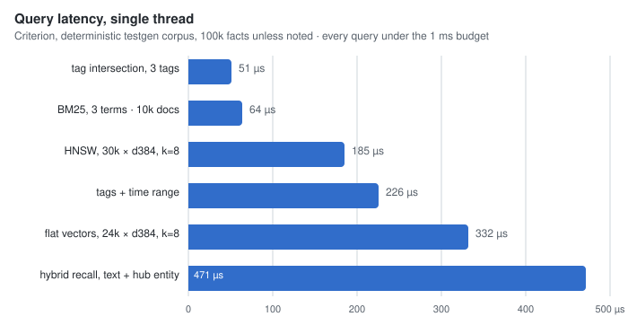

# plugmem-core

An embedded long-term memory engine for LLM agents: a `no_std + alloc`
Rust library that stores an agent's facts and serves them back as a
ranked, token-budgeted context block. It follows the SQLite model — the
engine is a library inside your process, there is no server, and a whole
database is one snapshot file plus an append-only journal.

The core owns no I/O, no clock and no threads. Bytes enter and leave
through a five-method `Storage` trait, timestamps arrive as parameters,
and embeddings are computed by the caller — which is what lets the same
engine run natively, in `wasm32v1-none`, or anywhere else Rust compiles.

## Who this is for

Agents and applications that need a **personal memory**: tens of
thousands to a million facts about a user, a project, a codebase — with
temporal reasoning ("what was true then"), revision history, a
relationship graph, and hybrid retrieval, all inside the process and
inside a single file. It is not a horizontally scalable search cluster
and does not try to be one; the capacity passport is deliberately sized
to the 32-bit wasm address space (≤ 2 GiB, design center 100k facts,
ceiling 1M).

## Quick start

```rust
use plugmem_core::{Config, MemStorage, Memory, RecallQuery, RememberInput};

let mut store = MemStorage::new(); // file-backed storage lives in plugmem-host
let mut mem = Memory::new(Config::default()).unwrap();

let out = mem.remember(&mut store, RememberInput {
    entity: Some("user"),
    tags: &["pref"],
    ..RememberInput::text(1_784_000_000_000, "prefers tokio with pinned versions")
}).unwrap();
// out.similar lists live facts this one may duplicate or contradict —
// the engine never merges on its own; the caller decides.

let res = mem.recall(RecallQuery::text(1_784_000_100_000, "which runtime?")).unwrap();
println!("{}", res.rendered); // a compact, ranked block for the prompt

mem.snapshot(&mut store, 1_784_000_200_000).unwrap(); // full image + journal reset
```

## Data model

A **fact** is one short statement with an optional subject **entity**,
tags, an optional embedding, and two time axes (a simplified bitemporal
model):

- `recorded_at` — when the memory learned it (immutable);
- `valid_from / valid_to` — when it was/is true.

`revise` closes the old fact's validity interval and records the
successor; the old version is kept — "lived in Moscow (2023 → 2025)"
stays answerable through `as_of` queries. `forget` tombstones a fact
immediately; the next `maintain` removes it physically, and its id is
burned, never reissued. Entities form a graph through typed **edges**
(`works_at`, `depends_on`, …) with a provenance link back to the fact
that justified them.

| Verb | Effect |
|---|---|
| `remember` | new fact + indexes + similar-fact hints (Jaccard term overlap, vector cosine) |
| `recall` | hybrid ranked retrieval, zero allocations after warm-up |
| `revise` | close the predecessor, record the successor, keep the chain |
| `forget` | immediate tombstone; physical purge at `maintain` |
| `link` | upsert a typed edge between entities |
| `maintain` | the one O(base) verb: purge, compaction, index rebuilds, HNSW build |
| `snapshot` | full image + journal reset |

## Retrieval

Four sources feed one ranked result:

- **Lexical** — BM25 with the Robertson idf over delta-encoded
  ([LEB128](https://en.wikipedia.org/wiki/LEB128)) posting lists; the
  tokenizer does NFKC normalization,
  [UAX #29](https://unicode.org/reports/tr29/) word segmentation, Latin
  diacritic folding and CJK bigrams. A stop-frequency guard drops query
  terms whose posting lists would dominate the cost.
- **Vector** — embeddings are stored as symmetric int8 quantizations of
  the L2-normalized vector (f32 is never persisted). Below a configured
  threshold, search is a two-phase flat scan: a Hamming prefilter over
  1-bit sign signatures, then an exact quantized-cosine rescore of the
  best candidates. Above the threshold, `maintain` builds an
  [HNSW](https://arxiv.org/abs/1603.09320) graph (Malkov & Yashunin)
  with the neighbor-selection heuristic and early-stopped beam search;
  vectors added since the last build sit in a flat tail that is scanned
  exactly and merged.
- **Graph** — bounded breadth-first expansion from entity anchors over
  the edge arenas, with hard budgets on entities, edges, candidates and
  examined posting entries (a hub entity cannot blow the query up).
- **Temporal** — range scans over a `recorded_at`-ordered index.

Sources are fused with [reciprocal rank
fusion](https://dl.acm.org/doi/10.1145/1571941.1572114) (Cormack, Clarke
& Buettcher) — rank-based, so the sources need no score calibration —
plus an exponential recency boost. Selection is greedy under `k` and a
token budget, and the result includes both structured facts and a
rendered block ready to paste into a prompt.

## Storage and durability

All state lives in flat byte structures (sorted page arenas, blob heaps,
chunked lists, an interner) from `plugmem-arena`. The consequence: **the
memory image is the file format**. A snapshot is the concatenation of
each structure's sections, 64-byte aligned, with
[xxh3](https://github.com/Cyan4973/xxHash) checksums per section and
over the whole file; loading is bounds-checking the metadata and
adopting the bytes — no per-record parsing.

Between snapshots, every mutation appends one framed record to a
journal. Replay is deterministic to the byte: quantization is a pure
function, HNSW levels are a pure function of the fact id, and `maintain`
re-executes identically — so `snapshot → crash → replay` and the
uninterrupted engine produce the same file. A torn journal tail (crash
mid-append) is detected and dropped; any other inconsistency is a typed
error. Snapshots are canonical: save → load → save is byte-identical.

The loader treats every input as untrusted: arbitrary bytes can produce
any `Error` but never a panic or undefined behavior, and after a
successful load every stored id is range-checked, every chunk chain
walked, every invariant the hot path relies on re-established.

Each database carries a `db_uuid` (minted by the host at creation) so
external holders of fact ids can tell "same database" from "a different
one".

## Performance

Deterministic work counters (`cmp_ops`, `postings_decoded`,
`dist_evals`, allocation counts — behind the `counters` feature) act as
CI gates: a complexity regression fails the same way on any machine.
`recall` and `get` perform **zero allocator calls** after warm-up,
enforced by a counting-allocator test.



| Operation (single thread, native) | Latency |
|---|---|
| tag intersection, 3 tags @ 100k facts | 51 µs |
| BM25, 3 terms @ 10k docs | 64 µs |
| HNSW vector search, 30k × dim 384, k=8, ef=64 | 185 µs |
| tags + time-range recall @ 100k | 226 µs |
| flat vector search, 24k × dim 384, k=8 | 332 µs |
| hybrid recall (text + hub entity anchor) @ 100k | 471 µs |
| `remember` (tokenize, index, quantize d384, similar-detect, journal) | 72 µs mean |
| one-time HNSW build inside `maintain` | ~1.6 ms/vector |

Reproduce with `cargo bench -p plugmem-core` (Criterion; benchmarks are
a separate target and never run under `cargo test`). Corpora come from
`plugmem-testgen` — seeded, so every run measures the same workload.

## Limits, stated plainly

- Single-threaded, single-writer. Concurrency belongs to the embedding
  process (the `plugmem-host` crate serializes access to a file).
- ≤ 2 GiB of state; ids are `u32`; texts ≤ 4 KiB; dimensions ≤ 4096.
- Vector search is quantized (int8) — exact f32 scores are never
  computed — and approximate above the HNSW threshold (recall@10 ≥ 0.9
  against brute force is a test gate, not a proof).
- The tokenizer does no stemming or lemmatization.
- `maintain` is O(database) and the first one past the HNSW threshold
  pays the graph build; call it on your schedule, not on a hot path.
- The snapshot format is not yet frozen (pre-1.0): a new version may
  require re-importing, not migrating.

## Features and targets

- `std` *(default)* — convenience only; the crate is fully functional as
  `no_std + alloc` and builds for `wasm32v1-none` in CI.
- `counters` — the deterministic work counters; zero cost when off.

## License

MIT.
